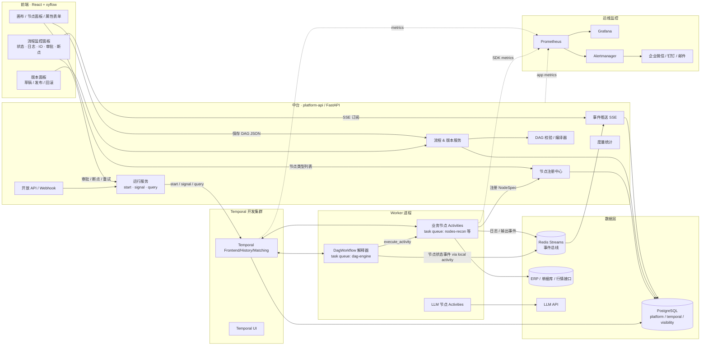
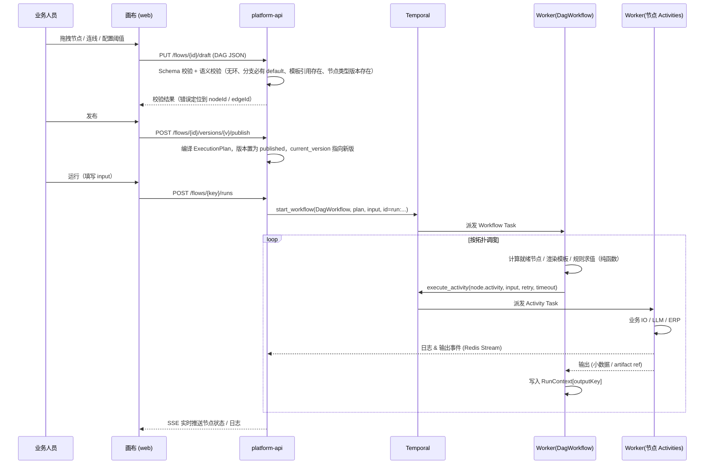
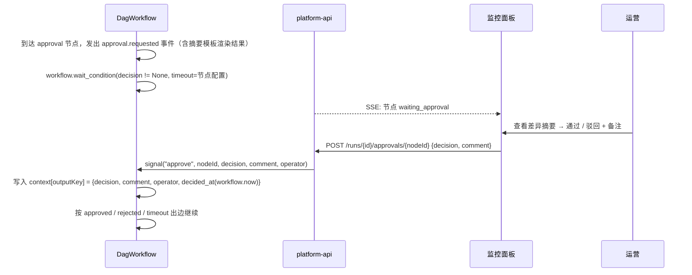

# AI 智能体底座（Agent Foundation）总体方案

> 版本：v0.1（待确认）  
> 范围：阶段 1（画布原型 / Temporal 开发集群 / AI 对账编排 Demo / 节点 SDK 规范）+ 阶段 2（分支、变量透传、重试配置、版本管理、人工审批、监控告警、业务人员试用）  
> 文档集索引见 [`docs/README.md`](./README.md)

---

## 1. 背景与目标

现有 ERP（凭证、成本、对账等）业务逻辑大量沉淀在 VB6 / 存储过程中，后续 AI 销售、AI 采购、AI 对账等应用智能体需要一个**统一、可靠、可观测、可被业务人员编排**的执行底座，而不是每个智能体各写一套调度与容错。

本方案交付一个 **"声明式流程编排 + 持久化工作流引擎 + 原子能力插件"** 的底座：

| 目标 | 说明 |
|---|---|
| 业务可编排 | 业务/运营人员在 React + xyflow 画布上拖拽节点、连线、配置分支和阈值，**不需要后端改代码** |
| 执行可靠 | 引擎采用 Temporal：崩溃恢复、自动重试、超时、长时间等待人工审批（天/周级）、精确一次的编排语义 |
| 能力可插拔 | 任何业务原子能力（拉单据、差异识别、LLM 提取、ERP 回写）按《原子节点注册 SDK 规范》封装为 Temporal Activity，自动出现在画布节点面板 |
| 过程可观测 | 节点级状态、日志、输入输出、耗时、失败率实时回传前端；失败告警接入企业 IM |
| 可治理 | 流程草稿 / 发布 / 回滚版本管理；运行实例固定绑定发布版本；开放 API 供外部系统触发 |

---

## 2. 设计原则（同时也是"坑规避"的落地方式）

| # | 原则 | 落地手段 | 对应坑 |
|---|---|---|---|
| P1 | **Workflow 只编排，不做 IO** | 唯一的通用 `DagWorkflow` 解释器只做：拓扑调度、分支判断、等待 Signal、调用 Activity、Child Workflow。所有 HTTP / DB / LLM / 当前时间 / 随机数一律在 Activity 内。Python SDK 开启 **Workflow Sandbox**，静态拦截 `datetime.now()`、`requests` 等非确定性调用；CI 中跑 **Replay 测试** | 坑 1 |
| P2 | **流程走向由 DAG 决定，不由 LLM 决定** | 分支节点使用结构化规则（字段 / 比较符 / 值），由 Workflow 内的**纯函数规则引擎**求值；LLM 节点只是一个普通 Activity，输出结构化字段写入上下文，供规则节点判断 | 坑 2 |
| P3 | **上下文只存"小数据 + 引用"** | 每个运行实例独立 `RunContext`（JSON，软限制 256 KB）；节点输出超过 64 KB 自动落 `artifacts` 表 / 对象存储并以 `ref://artifact/<id>` 引用；原始单据、对话记录一律只存 ID | 坑 3 |
| P4 | **解释执行，不生成代码** | DAG JSON → 校验 → `ExecutionPlan` → 作为**输入参数**传给通用 `DagWorkflow`。新增/修改流程零部署，只需发布新版本；运行实例绑定版本快照，保证回放确定性 | 坑 1 / 需求 4 |
| P5 | **前后端单一契约** | `DAG JSON Schema` 是画布输出、后端校验、Workflow 输入三方共同遵守的唯一契约（见 01 文档） | 需求 4 |
| P6 | **节点即插件** | 节点 = `NodeSpec`（元数据 + JSON Schema）+ Activity 实现，Worker 启动自动注册到"节点注册中心"，画布节点面板从注册中心拉取 | 需求 2 |
| P7 | **Temporal History 是事实源，平台库是投影** | 节点状态 / 日志事件由 Activity 与 Workflow 侧写入 `run_events`，供前端实时展示与度量统计；任何时候都可以从 Temporal History 重建 | 需求 3 |

---

## 3. 总体架构



### 3.1 关键分层

| 层 | 组件 | 职责 |
|---|---|---|
| 展现层 | `apps/web` | 画布编排、属性配置、版本管理、运行监控、审批操作 |
| 中台层 | `apps/platform-api` | 流程/版本 CRUD、DAG 校验编译、节点注册中心、运行控制（start / signal / query / cancel）、事件推送、开放 API、度量 |
| 引擎层 | Temporal Server + `apps/worker` | `DagWorkflow` 解释器；业务节点 Activities；LLM 节点 Activities |
| 能力层 | `packages/node-sdk`、`nodes/*` | 节点 SDK（装饰器、上下文、日志、Artifact、错误分类）与具体业务节点包 |
| 数据层 | PostgreSQL / Redis / 对象存储 | 平台元数据、运行投影、事件流、大对象 |
| 运维层 | docker-compose / Prometheus / Grafana / Alertmanager | 部署、指标、告警 |

---

## 4. 技术选型

| 领域 | 选型 | 备选 | 选择理由 |
|---|---|---|---|
| 工作流引擎 | **Temporal Server 1.2x**（开发集群：docker-compose `auto-setup` + PostgreSQL 持久化） | Cadence / Conductor | 需求指定；Signal / Query / Update / Child Workflow / 长时等待原生支持 |
| 中台后端语言 | **Python 3.11 + FastAPI + `temporalio` SDK** | TypeScript (`@temporalio`) / Java / Go | ① 现有 `tools/*.py` 已用 Python；② LLM / 数据处理生态最成熟；③ Python SDK 自带 **Workflow Sandbox**，静态拦截非确定性代码（直接命中坑 1）；④ 对账、单据处理团队上手成本低。若团队更偏 TS，可整体替换为 TypeScript SDK，架构不变（见 08 文档决策点） |
| 前端 | **React 18 + TypeScript + Vite + `@xyflow/react` v12 + Zustand + Ant Design 5 + `@rjsf` (JSON Schema 表单)** | Vue + VueFlow | 需求指定；`@rjsf` 让节点配置表单直接由 `NodeSpec.configSchema` 生成，新增节点前端零改动 |
| 平台数据库 | **PostgreSQL 15**（与 Temporal 共用实例、不同库） | MySQL | Temporal 官方支持；JSONB 存 DAG / 上下文；`LISTEN/NOTIFY` 可作为开发期事件总线降级方案 |
| 事件总线 | **Redis 7 Streams**（开发期可降级为 PG `LISTEN/NOTIFY`） | Kafka / NATS | 轻量；支持消费组、回溯；SSE 推送前端 |
| 大对象存储 | 开发期：PG `artifacts` 表（bytea/JSONB）；生产：MinIO / S3 | — | 上下文只存引用（坑 3） |
| 规则/表达式 | **结构化规则（JSON）+ 受限表达式**（纯函数、白名单运算符，无时间/随机/IO） | JSONLogic / CEL | 在 Workflow 内求值必须确定性；表单化利于业务人员 |
| 模板语法 | `{{context.xxx}}` / `{{input.xxx}}` / `{{nodes.<id>.output.xxx}}` | Jinja | 纯字符串替换 + JSONPath 子集，可在 Workflow 中确定性渲染 |
| 监控 | Prometheus + Grafana（Temporal 官方 Dashboard）+ Alertmanager；Temporal UI | Datadog | 开源、与 Temporal 原生对接 |
| 部署（开发） | docker-compose 单机 | K8s Helm | 阶段 1/2 目标是开发环境；生产迁移路径见 07 文档 |

---

## 5. 核心概念

| 概念 | 说明 | 落库 |
|---|---|---|
| **NodeType（节点类型）** | 一种原子能力的定义：`type@version` + 输入/输出/配置 JSON Schema + 默认重试超时 + UI 元数据。由 Worker 注册 | `node_types` |
| **Flow（流程）** | 一个业务编排（如"采购对账"），拥有多个版本 | `flows` |
| **FlowVersion（版本）** | 不可变的 DAG JSON 快照。状态：`draft` → `published` → `archived`；`flows.current_version_id` 指向当前发布版 | `flow_versions` |
| **DAG JSON** | 画布输出契约（见 01 文档）：nodes / edges / variables / policies | `flow_versions.dag` |
| **ExecutionPlan** | DAG 编译产物：校验后的拓扑、邻接表、节点绑定（activity 名、task queue、重试策略）。作为 `DagWorkflow` 的输入 | 随 run 快照 |
| **Run（运行实例）** | 一次流程执行 = 一个 Temporal Workflow Execution，`workflow_id = run:<flow_key>:<run_id>`；固定绑定 `flow_version_id` | `runs` |
| **NodeRun** | 某个 run 中某节点的一次执行（含重试次数、状态、输入/输出引用、耗时） | `run_nodes` |
| **RunContext** | 运行实例上下文：`input` + 各节点 `outputKey` 写入的值 + 系统字段。小数据 + 引用 | Workflow 状态 + `run_nodes.output` |
| **Signal / Update** | 外部与运行中 Workflow 交互：审批、断点恢复、手工重试 / 跳过、取消 | Temporal History |
| **Artifact** | 大对象（原始单据、LLM 全文、差异明细） | `artifacts` / 对象存储 |
| **RunEvent** | 节点状态变更、日志行、IO 快照、审批事件；前端实时订阅 | `run_events` + Redis Stream |

---

## 6. 仓库结构（Monorepo，建议）

```
AIFoundationNew/
├── docs/                        # 本方案文档集
├── schemas/
│   ├── dag.schema.json          # DAG JSON Schema（前后端契约）
│   └── node-spec.schema.json    # 节点 NodeSpec Schema
├── examples/
│   ├── reconciliation-demo.dag.json
│   └── node-spec.fetch_documents.json
├── apps/
│   ├── web/                     # React + xyflow 画布 & 监控
│   ├── platform-api/            # FastAPI 中台
│   └── worker/                  # Temporal Worker（解释器 + 节点加载）
├── packages/
│   ├── node-sdk/                # Python 节点 SDK（装饰器 / NodeContext / 错误 / Artifact）
│   ├── dag-core/                # DAG 校验、编译、规则引擎、模板渲染（纯函数，前后端共享语义；TS 版在 web 内）
│   └── contracts/               # 由 schema 生成的 TS / Pydantic 类型
├── nodes/
│   ├── recon/                   # 对账原子节点：fetch_documents / match_and_diff / classify_diff / generate_report
│   └── common/                  # 通用节点：http_request / llm_extract / notify
├── deploy/
│   ├── docker-compose.yml       # Temporal + PG + Redis + UI + Prometheus + Grafana + Alertmanager + 平台服务
│   ├── temporal/                # dynamicconfig、namespace 初始化脚本
│   ├── prometheus/  grafana/  alertmanager/
│   └── sql/                     # 平台库 DDL / 迁移
└── Makefile                     # make up / make demo / make test-replay
```

---

## 7. 关键流程时序

### 7.1 编排 → 发布 → 运行



### 7.2 人工审批（Signal）



### 7.3 断点 / 失败暂停 / 手工重试

- 画布或监控面板可对任意节点打断点（保存在 DAG 或运行时通过 `set_breakpoints` Signal 动态设置）。
- 到达断点节点前，Workflow 发出 `node.paused` 事件并 `wait_condition` 等待 `resume` / `skip` / `abort` Signal。
- Activity 重试耗尽后，若节点 `onError = pause`（默认），进入同样的等待状态；运营可 `retry`（重新 `execute_activity`）、`skip`（用配置的默认输出继续）或 `abort`。
- 所有等待都在 Workflow 内，跨 Worker 重启、跨天有效。

---

## 8. 阶段范围与交付物

### 阶段 1

| 交付物 | 内容 | 验收 |
|---|---|---|
| 画布原型 | 节点面板（来自注册中心）、拖拽、连线、属性表单、保存 / 加载 DAG JSON、客户端校验 | 能编排并保存对账 Demo DAG，导出 JSON 通过 `dag.schema.json` 校验 |
| Temporal 开发集群 | docker-compose：Temporal Server + PostgreSQL + Temporal UI + Prometheus + Grafana | `make up` 一键启动；Temporal UI 可见 namespace `agent-platform` |
| DAG 解析器最小版 | 校验 → 编译 → `DagWorkflow` 解释执行线性 + 并行分叉的 DAG | 对账 DAG 在 Temporal UI 可见完整 History；Replay 测试通过 |
| 对账原子能力 | `recon.fetch_documents`、`recon.match_and_diff`、`recon.classify_diff`（规则版，LLM 可选）、`recon.generate_report` | 每个节点独立单测；输出大于阈值自动落 artifact |
| 可运行 Demo | 画布编排 → 运行 → 执行 / 重试（注入故障）/ 断点 / 日志实时回传前端 | 四项测试用例全部通过（见 08 文档） |
| 节点注册 SDK 规范 | 02 文档 + `packages/node-sdk` + 示例节点 + 接入 Checklist | 按规范新增一个 `http_request` 节点，不改平台代码即出现在画布 |

### 阶段 2

| 能力 | 内容 |
|---|---|
| 分支判断 | `branch` 节点：结构化规则（多 case + default），Workflow 内纯函数求值；画布上按 case 输出多个连接桩 |
| 变量透传 | `{{...}}` 模板：`input` / `context` / `nodes.<id>.output`；属性面板提供变量选择器；`assign` 节点做上下文赋值 |
| 节点重试配置 | 节点级 `retryPolicy`（次数 / 初始间隔 / 退避系数 / 最大间隔 / 不重试错误类型）、`timeouts`、`onError`(pause / fail / skip / fallbackEdge) |
| 流程版本管理 | draft / published / archived；发布不可变；一键回滚；运行绑定版本；版本 Diff |
| 人工审批节点 | `approval` 节点 + Signal；审批超时策略；审批记录落库；监控面板一键审批 |
| 监控告警 | 节点失败 / 审批超时 / Worker 掉线告警到企业 IM；运行日志、输入输出查看；节点耗时、失败率统计 |
| 业务人员试用 | 业务人员修改"大额差异阈值"分支规则并发布，无需后端改动即生效；培训手册 |
| 扩展能力（平台复用） | 子流程节点（Child Workflow）、开放 API（API Key + Webhook）、流程度量看板 |

---

## 9. 坑规避对照表

| 坑 | 具体风险 | 本方案的硬性约束 | 校验手段 |
|---|---|---|---|
| 坑 1 非确定性 | Workflow 里调 HTTP / DB / LLM / `datetime.now()` / `random` / 读环境变量；升级解释器逻辑导致旧 run 回放失败 | ① `DagWorkflow` 只 import `temporalio.workflow` 与 `dag-core` 纯函数；② 时间用 `workflow.now()`，随机用 `workflow.random()`；③ 事件发送走 Local Activity；④ `ExecutionPlan` 作为输入参数快照，不在 Workflow 内查库；⑤ 解释器行为变更用 `workflow.patched("v2")`；⑥ 长循环 `continue_as_new` | Python Sandbox（运行时拦截）+ CI Replay 测试（用 History 文件回放） |
| 坑 2 LLM 决定流程 | LLM 输出"下一步走哪"导致不可控 | LLM 节点 `outputSchema` 必须是结构化字段（如 `category`、`confidence`），由 `branch` 节点规则决定走向；`branch` 规则引擎不接受自由文本 | DAG 校验：`branch` 条件只能引用上下文字段 + 白名单运算符 |
| 坑 3 上下文膨胀 | 原始单据、LLM 全文塞进 Workflow 状态，History 爆炸（Temporal 单事件 2 MB / History 50 MB 限制） | SDK 层：节点输出 > 64 KB 自动落 artifact 并返回 `ref`；`RunContext` 总量 > 256 KB 告警、> 1 MB 拒绝；`fetch_documents` 只输出 `batch_id + 数量 + 汇总`，明细走 artifact | SDK 单测 + 运行时指标 `run_context_bytes` |
| 补充：Activity 幂等 | 重试导致重复回写 ERP / 重复发通知 | 节点 SDK 强制提供 `idempotency_key = run_id + node_id + attempt_group`；写类节点必须声明 `sideEffect: true` 并实现幂等 | 02 文档 Checklist |
| 补充：版本漂移 | 运行中修改流程导致 run 行为变化 | run 绑定 `flow_version_id`，plan 快照随 run 保存；节点类型按 `type@major` 绑定 | 数据库外键 + 编译期校验 |

---

## 10. 待确认决策点（请在评审时确认）

1. **后端语言**：推荐 Python（`temporalio` + FastAPI）；如团队希望前后端统一 TypeScript，可切换到 `@temporalio/*` + NestJS，架构与契约不变。
2. **ERP 数据接入方式**：`fetch_documents` 阶段 1 先用 Mock + 可切换到 SQL Server / 现有接口；需要确认单据表结构与访问方式（直连库 / HTTP 接口 / 导出文件）。
3. **LLM 供应商与部署形态**：`classify_diff` 默认规则版，LLM 版本需要确认模型（OpenAI 兼容接口 / 通义 / 私有化部署）与数据合规要求。
4. **告警通道**：企业微信 / 钉钉 / 飞书 / 邮件，请确认一种作为阶段 2 接入。
5. **审批人模型**：阶段 2 采用"角色 + 指定人"简化模型，是否需要对接现有组织架构 / SSO。
6. **大对象存储**：开发期用 PostgreSQL；是否在阶段 2 就引入 MinIO。
7. **循环 / 并行 fan-out 节点**：阶段 2 仅支持静态并行分叉；动态 `for-each`（按单据逐条处理）建议放阶段 3，是否需要提前。

确认以上决策点后，将按本方案生成**高保真原型 HTML**（画布编排页、节点属性面板、运行监控面板、审批弹窗、版本管理页），再进入开发。
