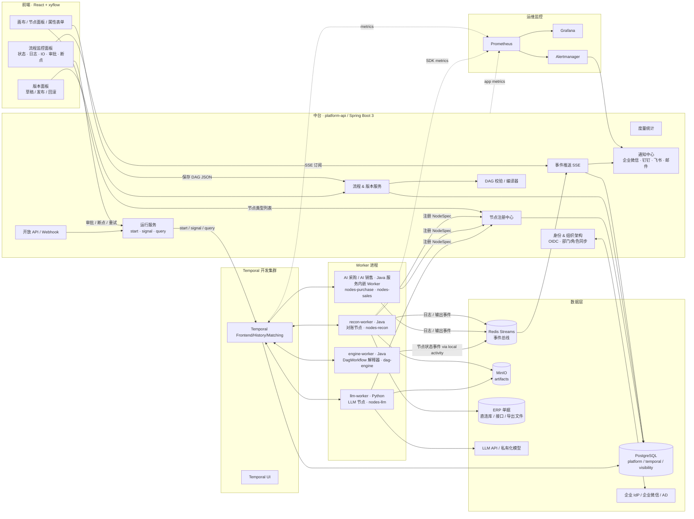
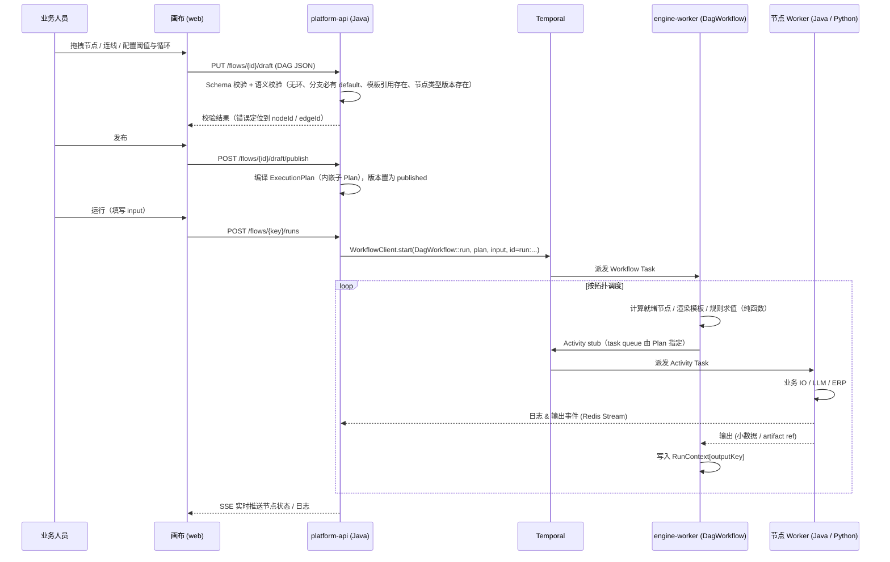
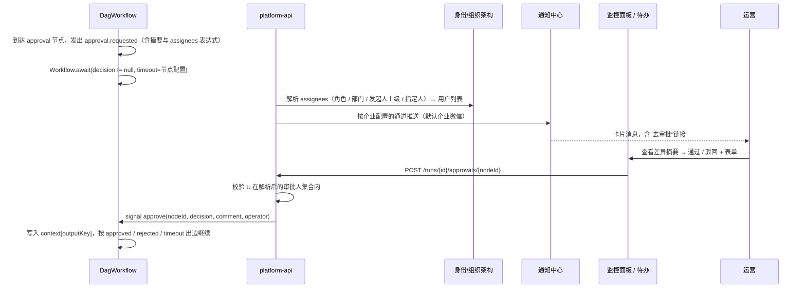

# AI 智能体底座（Agent Foundation）总体方案

> 版本：v0.2（决策点已确认，进入原型阶段）  
> 范围：阶段 1（画布原型 / Temporal 开发集群 / AI 对账编排 Demo / 节点 SDK 规范）+ 阶段 2（分支、变量透传、for-each 循环、节点重试配置、版本管理、人工审批、组织架构/SSO、监控告警、业务人员试用）  
> 文档集索引见 [`docs/README.md`](./README.md)；高保真原型见 [`prototype/index.html`](../prototype/index.html)

---

## 0. 已确认决策（v0.2）

| # | 决策点 | 结论 | 影响的文档 |
|---|---|---|---|
| 1 | 后端语言 | **Java 17 + Spring Boot 3 + Temporal Java SDK**。中台 API、`DagWorkflow` 解释器、节点 SDK 主实现均为 Java；Python 仅保留 `llm-worker`（LLM 抽取/分类类节点，独立队列 `nodes-llm`） | 00 / 02 / 03 / 05 / 06 |
| 2 | ERP 单据接入 | **直连库 / 接口 / 导出文件三种方式都要支持**。以"标准单据模型 + `DocumentSource` 适配器 SPI"统一，三种实现：`JdbcDocumentSource`、`HttpDocumentSource`、`FileImportDocumentSource`；每个企业/数据源通过 `source_profile` 配置字段映射 | 02 / 07 |
| 3 | 告警通道 | **企业微信为默认，通道可配置**。`NotificationChannel` SPI：wecom / dingtalk / feishu / email / webhook，按企业（租户）在管理后台配置，流程与节点只引用通道名 | 05 / 06 |
| 4 | 审批人与组织架构 | **对接组织架构与 SSO**。OIDC 登录（Keycloak 开发环境；生产可接企业微信 / AD / 现有 IdP），`IdentityProvider` SPI 同步部门 / 用户 / 角色；审批人支持角色、部门、指定人、动态表达式（如发起人上级） | 01 / 04 / 05 / 06 |
| 5 | 大对象存储 | **阶段 1 即引入 MinIO**（S3 协议），artifact 统一走对象存储，PostgreSQL 只存元数据 | 05 / 06 |
| 6 | 动态 for-each 循环 | **提前到阶段 2**。新增 `foreach` 节点：按上下文数组逐项执行（单节点体或子流程体），并发上限、逐项失败策略、结果收集，大列表分批 `continue-as-new` | 01 / 03 / 04 / 07 |
| 7 | LLM 供应商 | 未指定 → 设计为 **可配置 LLM Profile**（OpenAI 兼容接口为默认协议，支持私有化模型），节点只引用 `llm_profile` 名称 | 02 / 06 |

---

## 1. 背景与目标

现有 ERP（凭证、成本、对账等）业务逻辑大量沉淀在 VB6 / 存储过程中，AI 采购、AI 销售等智能体已用 **Java** 实现。后续所有应用智能体需要一个**统一、可靠、可观测、可被业务人员编排**的执行底座，而不是每个智能体各写一套调度与容错。

本方案交付一个 **"声明式流程编排 + 持久化工作流引擎 + 原子能力插件"** 的底座：

| 目标 | 说明 |
|---|---|
| 业务可编排 | 业务/运营人员在 React + xyflow 画布上拖拽节点、连线、配置分支、循环和阈值，**不需要后端改代码** |
| 执行可靠 | 引擎采用 Temporal：崩溃恢复、自动重试、超时、长时间等待人工审批（天/周级）、精确一次的编排语义 |
| 能力可插拔 | 任何业务原子能力（拉单据、差异识别、LLM 提取、ERP 回写）按《原子节点注册 SDK 规范》封装为 Temporal Activity，自动出现在画布节点面板；**现有 Java 智能体服务内嵌 Worker 即可把原有方法变成节点** |
| 过程可观测 | 节点级状态、日志、输入输出、耗时、失败率实时回传前端；失败告警按企业配置推送到企业微信等通道 |
| 可治理 | 流程草稿 / 发布 / 回滚版本管理；运行实例固定绑定发布版本；审批人来自组织架构；开放 API 供外部系统触发 |

---

## 2. 设计原则（同时也是"坑规避"的落地方式）

| # | 原则 | 落地手段 | 对应坑 |
|---|---|---|---|
| P1 | **Workflow 只编排，不做 IO** | 唯一的通用 `DagWorkflow` 解释器只做：拓扑调度、分支判断、循环展开、等待 Signal、调用 Activity、Child Workflow。所有 HTTP / DB / LLM / 当前时间 / 随机数一律在 Activity 内。Java 侧用 **ArchUnit 规则**禁止 workflow 包依赖 `java.time.Instant.now`/JDBC/HTTP 客户端，CI 用 **`WorkflowReplayer` 回放测试**；Python `llm-worker` 只有 Activity，不含 Workflow | 坑 1 |
| P2 | **流程走向由 DAG 决定，不由 LLM 决定** | 分支节点使用结构化规则（字段 / 比较符 / 值），由 Workflow 内的**纯函数规则引擎**求值；LLM 节点只是一个普通 Activity，输出结构化字段写入上下文，供规则节点判断 | 坑 2 |
| P3 | **上下文只存"小数据 + 引用"** | 每个运行实例独立 `RunContext`（JSON，软限制 256 KB）；节点输出超过 64 KB 自动落 **MinIO** 并以 `ref://artifact/<id>` 引用；原始单据、对话记录一律只存 ID；`foreach` 只迭代 ID 列表，明细由循环体自取 | 坑 3 |
| P4 | **解释执行，不生成代码** | DAG JSON → 校验 → `ExecutionPlan` → 作为**输入参数**传给通用 `DagWorkflow`。新增/修改流程零部署，只需发布新版本；运行实例绑定版本快照，保证回放确定性 | 坑 1 / 需求 4 |
| P5 | **前后端单一契约** | `DAG JSON Schema` 是画布输出、后端校验、Workflow 输入三方共同遵守的唯一契约（见 01 文档）；`dag-core` 规则/模板引擎 **TS + Java 双实现**共享测试向量 | 需求 4 |
| P6 | **节点即插件，语言无关** | 节点 = `NodeSpec`（元数据 + JSON Schema）+ Activity 实现。Temporal 按 Task Queue + JSON Payload 通信，Java 节点与 Python LLM 节点对解释器完全透明；Worker 启动自动注册到"节点注册中心" | 需求 2 |
| P7 | **Temporal History 是事实源，平台库是投影** | 节点状态 / 日志事件由 Activity 与 Workflow 侧写入 `run_events`，供前端实时展示与度量统计；任何时候都可以从 Temporal History 重建 | 需求 3 |
| P8 | **企业差异走配置，不走代码** | 数据源（ERP 三种接入）、通知通道、身份源、LLM 供应商、对象存储全部是 SPI + 配置项（`profile`），流程 DAG 只引用名称 | 决策 2/3/4/7 |

---

## 3. 总体架构



### 3.1 关键分层

| 层 | 组件 | 语言 | 职责 |
|---|---|---|---|
| 展现层 | `apps/web` | TS / React | 画布编排、属性配置、版本管理、运行监控、审批操作、组织架构选人 |
| 中台层 | `apps/platform-api` | Java / Spring Boot 3 | 流程/版本 CRUD、DAG 校验编译、节点注册中心、运行控制、事件投影与 SSE、开放 API、度量、身份/组织架构、通知中心 |
| 引擎层 | Temporal Server + `apps/engine-worker` | Java | `DagWorkflow` 解释器（`dag-engine` 队列） |
| 能力层 | `packages/node-sdk-java`、`packages/node-sdk-python`、`nodes/*` | Java 主 / Python 副 | 节点 SDK；对账节点；现有 Java 智能体内嵌 Worker；LLM 节点 |
| 数据层 | PostgreSQL / Redis / MinIO | — | 平台元数据、运行投影、事件流、大对象 |
| 集成层 | SPI：`DocumentSource` / `NotificationChannel` / `IdentityProvider` / `LlmProvider` / `ArtifactStore` | Java | 企业差异化配置点 |
| 运维层 | docker-compose / Prometheus / Grafana / Alertmanager | — | 部署、指标、告警 |

---

## 4. 技术选型

| 领域 | 选型 | 备选 | 选择理由 |
|---|---|---|---|
| 工作流引擎 | **Temporal Server 1.2x**（开发集群：docker-compose `auto-setup` + PostgreSQL 持久化） | Cadence / Conductor | 需求指定；Signal / Query / Update / Child Workflow / 长时等待原生支持；多语言 Worker |
| 中台与解释器 | **Java 17 + Spring Boot 3 + Temporal Java SDK + `temporal-spring-boot-starter`** | Python（v0.1 方案） | AI 采购 / AI 销售已是 Java，节点 SDK 的主要使用者是 Java 团队；Java SDK 是 Temporal 最成熟的 SDK；`dag-core` 只需 TS + Java 双实现；运维与现有 Java 服务共用一套 |
| LLM 节点 | **Python 3.11 + `temporalio`**（`llm-worker`，仅 Activity） | Java LangChain4j / Spring AI | 保留 Python LLM 生态；通过 Task Queue 与 Java 解释器解耦；简单 LLM 调用也可用 Java 节点实现 |
| 前端 | **React 18 + TypeScript + Vite + `@xyflow/react` v12 + Zustand + Ant Design 5 + `@rjsf`** | Vue + VueFlow | 需求指定；`@rjsf` 让节点配置表单直接由 `NodeSpec.configSchema` 生成 |
| 平台数据库 | **PostgreSQL 15** | MySQL | Temporal 官方支持；JSONB 存 DAG / 上下文 |
| 事件总线 | **Redis 7 Streams** | Kafka | 轻量；消费组、回溯；SSE 推送前端 |
| 大对象存储 | **MinIO（S3 协议），阶段 1 引入** | PG bytea | 决策 5；生产直接换云对象存储，代码不变 |
| 身份与组织架构 | **OIDC（开发：Keycloak；生产：企业 IdP / 企业微信扫码 / AD via Keycloak 联邦）+ `IdentityProvider` SPI 同步组织架构** | 自建用户体系 | 决策 4；Spring Security OAuth2 Resource Server 原生支持 |
| 通知 | **`NotificationChannel` SPI，企业微信默认**；钉钉 / 飞书 / 邮件 / 通用 Webhook | 固定单通道 | 决策 3 |
| 规则/表达式 | **结构化规则（JSON）+ 受限表达式**，纯函数 | JSONLogic / CEL | Workflow 内求值必须确定性；表单化利于业务人员 |
| 模板语法 | `{{context.xxx}}` / `{{input.xxx}}` / `{{item.xxx}}`（循环体内） | Jinja | 纯字符串替换 + JSONPath 子集 |
| 监控 | Prometheus + Grafana（Temporal 官方 Dashboard）+ Alertmanager；Temporal UI；Micrometer | Datadog | 开源、与 Temporal 与 Spring Boot 原生对接 |
| 部署（开发） | docker-compose 单机 | K8s Helm | 阶段 1/2 目标是开发环境；生产迁移路径见 06 文档 |

---

## 5. 核心概念

| 概念 | 说明 | 落库 |
|---|---|---|
| **NodeType（节点类型）** | 一种原子能力的定义：`type@major` + 输入/输出/配置 JSON Schema + 默认重试超时 + UI 元数据。由 Worker 注册，语言无关 | `node_types` |
| **Flow（流程）** | 一个业务编排（如"采购对账"），拥有多个版本 | `flows` |
| **FlowVersion（版本）** | 不可变的 DAG JSON 快照。状态：`draft` → `published` → `archived`；`flows.current_version_id` 指向当前发布版 | `flow_versions` |
| **DAG JSON** | 画布输出契约（见 01 文档）：nodes / edges / variables / settings | `flow_versions.dag` |
| **ExecutionPlan** | DAG 编译产物：校验后的拓扑、邻接表、节点绑定（activity 名、task queue、重试策略）、内嵌子 Plan。作为 `DagWorkflow` 的输入 | 随 run 快照 |
| **Run（运行实例）** | 一次流程执行 = 一个 Temporal Workflow Execution，`workflow_id = run:<flow_key>:<run_id>`；固定绑定 `flow_version_id` | `runs` |
| **NodeRun** | 某个 run 中某节点的一次执行（含重试次数、状态、输入/输出引用、耗时）；`foreach` 的每个 item 是一条子记录 | `run_nodes` |
| **RunContext** | 运行实例上下文：`input` + 各节点 `outputKey` 写入的值 + 系统字段。小数据 + 引用 | Workflow 状态 + `run_nodes.output` |
| **Signal / Update** | 外部与运行中 Workflow 交互：审批、断点恢复、手工重试 / 跳过、取消 | Temporal History |
| **Artifact** | 大对象（原始单据、LLM 全文、差异明细、报告），存 MinIO | `artifacts`（元数据） |
| **RunEvent** | 节点状态变更、日志行、IO 快照、审批事件；前端实时订阅 | `run_events` + Redis Stream |
| **Profile（配置项）** | 企业差异化配置：`source_profile`（ERP 数据源）、`notification_channel`、`llm_profile`、`identity_provider` | `profiles` |

---

## 6. 仓库结构（Monorepo）

```
AIFoundationNew/
├── docs/                          # 方案文档集
├── prototype/                     # 高保真原型 HTML（评审用，静态）
├── schemas/
│   ├── dag.schema.json            # DAG JSON Schema（前后端契约）
│   └── node-spec.schema.json      # NodeSpec Schema
├── examples/
├── apps/
│   ├── web/                       # React + xyflow 画布 & 监控（TS）
│   ├── platform-api/              # Spring Boot 3 中台（Java）
│   ├── engine-worker/             # Temporal Java Worker：DagWorkflow 解释器
│   ├── recon-worker/              # Java Worker：对账节点
│   └── llm-worker/                # Python Worker：LLM 节点（仅 Activity）
├── packages/
│   ├── dag-core-java/             # 校验 / 编译 / 规则 / 模板（纯函数）
│   ├── dag-core-ts/               # 同上 TS 版，前端使用；共享 tests/vectors/*.json
│   ├── node-sdk-java/             # @AgentNode、NodeContext、Artifact、幂等、测试工具、spring-boot-starter
│   ├── node-sdk-python/           # LLM 节点用的精简 SDK（同一契约）
│   ├── integration-spi/           # DocumentSource / NotificationChannel / IdentityProvider / LlmProvider / ArtifactStore 接口
│   └── contracts/                 # 由 schema 生成的 TS / Java 类型
├── nodes/
│   ├── recon/                     # 对账原子节点（Java）
│   ├── common/                    # http_request / sql_query / notify / file_import（Java）
│   └── llm/                       # llm_extract / classify_text（Python）
├── integrations/
│   ├── document-source-jdbc/  document-source-http/  document-source-file/
│   ├── notify-wecom/  notify-dingtalk/  notify-feishu/  notify-email/  notify-webhook/
│   └── identity-oidc/  identity-wecom/  identity-ldap/
├── deploy/
│   ├── docker-compose.yml         # Temporal + PG + Redis + MinIO + Keycloak + UI + Prom/Grafana/Alertmanager + 平台服务
│   ├── temporal/  postgres/  minio/  keycloak/  prometheus/  grafana/  alertmanager/
│   └── sql/                       # Flyway 迁移
└── Makefile
```

---

## 7. 关键流程时序

### 7.1 编排 → 发布 → 运行



### 7.2 人工审批（Signal + 组织架构）



### 7.3 断点 / 失败暂停 / 手工重试

- 画布或监控面板可对任意节点打断点（保存在 DAG 或运行时通过 `setBreakpoints` Signal 动态设置）。
- 到达断点节点前，Workflow 发出 `node.paused` 事件并 `Workflow.await` 等待 `resume` / `skip` / `abort` Signal。
- Activity 重试耗尽后，若节点 `onError = pause`（默认），进入同样的等待状态；运营可 `retry`、`skip` 或 `abort`。
- 所有等待都在 Workflow 内，跨 Worker 重启、跨天有效。

### 7.4 for-each 循环

- `foreach` 节点从上下文取 **ID 列表**（如供应商编码数组），按 `concurrency` 并发对每个 item 启动循环体（单个 Activity 或 Child Workflow）。
- 每个 item 有独立作用域 `{{item}}` / `{{loop.index}}`；输出按 `collect` 策略汇总为列表或计数写回上下文。
- 逐项失败策略 `continue` / `fail_fast`；单批超过 `batchSize` 时 `continue-as-new` 续跑，避免 History 膨胀。

---

## 8. 阶段范围与交付物

### 阶段 1

| 交付物 | 内容 | 验收 |
|---|---|---|
| 画布原型 | 节点面板（来自注册中心）、拖拽、连线、属性表单、保存 / 加载 DAG JSON、客户端校验 | 能编排并保存对账 Demo DAG，导出 JSON 通过 `dag.schema.json` 校验 |
| Temporal 开发集群 | docker-compose：Temporal + PostgreSQL + Redis + **MinIO** + **Keycloak** + Temporal UI + Prometheus + Grafana + Alertmanager | `make up` 一键启动 |
| DAG 解析器最小版 | Java `DagWorkflow`：校验 → 编译 → 解释执行线性 + 并行分叉 | Temporal UI 可见完整 History；`WorkflowReplayer` 回放通过 |
| 对账原子能力（Java） | `recon.fetch_documents`（三种 `DocumentSource`）、`recon.match_and_diff`、`recon.classify_diff`（规则版；LLM 版在 `llm-worker`）、`recon.generate_report` | 每个节点独立单测；输出大于阈值自动落 MinIO |
| 可运行 Demo | 画布编排 → 运行 → 执行 / 重试 / 断点 / 日志实时回传前端 | 测试矩阵 T1–T5、T11、T14、T15 通过（07 文档） |
| 节点注册 SDK 规范 | 02 文档 + `node-sdk-java`（含 spring-boot-starter）+ `node-sdk-python` + 示例节点 + 接入 Checklist | 按规范在一个现有 Java 服务内嵌 Worker 新增节点，不改平台代码即出现在画布 |

### 阶段 2

| 能力 | 内容 |
|---|---|
| 分支判断 | `branch` 节点：结构化规则（多 case + default），Workflow 内纯函数求值；画布上按 case 输出多个连接桩 |
| 变量透传 | `{{...}}` 模板：`input` / `context` / `nodes.<id>.output` / `item`；变量选择器；`assign` 节点 |
| **for-each 循环** | `foreach` 节点：items 表达式、并发、逐项失败策略、结果收集、分批 continue-as-new；画布循环体配置 |
| 节点重试配置 | 节点级 `retryPolicy`、`timeouts`、`onError`(pause / fail / skip / route) |
| 流程版本管理 | draft / published / archived；发布不可变；一键回滚；运行绑定版本；版本 Diff |
| 人工审批节点 | `approval` 节点 + Signal；**审批人来自组织架构**（角色 / 部门 / 上级 / 指定人）；审批超时策略；待办中心；企业微信卡片 |
| **组织架构 / SSO** | OIDC 登录；部门 / 用户 / 角色同步；权限模型与审批人解析 |
| 监控告警 | 节点失败 / 审批超时 / Worker 掉线告警 → **可配置通知通道**；运行日志、输入输出查看；节点耗时、失败率统计 |
| 业务人员试用 | 业务人员修改"大额差异阈值"分支规则并发布，无需后端改动即生效；培训手册 |
| 扩展能力（平台复用） | 子流程节点（Child Workflow）、开放 API（API Key + Webhook）、流程度量看板 |

---

## 9. 坑规避对照表

| 坑 | 具体风险 | 本方案的硬性约束 | 校验手段 |
|---|---|---|---|
| 坑 1 非确定性 | Workflow 里调 HTTP / DB / LLM / `Instant.now()` / `Random` / 读环境变量；升级解释器逻辑导致旧 run 回放失败 | ① `DagWorkflow` 只依赖 `io.temporal.workflow` 与 `dag-core-java` 纯函数；② 时间用 `Workflow.currentTimeMillis()`，随机用 `Workflow.newRandom()`，UUID 用 `Workflow.randomUUID()`；③ 事件发送走 Local Activity；④ `ExecutionPlan` 与子 Plan 作为输入参数快照，不在 Workflow 内查库；⑤ 解释器行为变更用 `Workflow.getVersion("dag-v2", ...)`；⑥ 大循环 `Workflow.continueAsNew` | ArchUnit 静态规则（禁止 workflow 包 import `java.time.Instant/LocalDateTime.now`、`java.util.Random`、`java.net.http`、JDBC、Spring `@Autowired` 非纯组件）+ CI `WorkflowReplayer` 回放 `tests/histories/*.json` |
| 坑 2 LLM 决定流程 | LLM 输出"下一步走哪"导致不可控 | LLM 节点 `outputSchema` 必须是结构化字段；由 `branch` 节点规则决定走向；注册中心拒绝含 `next_node` / `route` 等保留字的输出 Schema | DAG 校验 + 注册中心校验 |
| 坑 3 上下文膨胀 | 原始单据、LLM 全文塞进 Workflow 状态，History 爆炸 | SDK 层：节点输出 > 64 KB 自动落 MinIO 并返回 `ref`；`RunContext` > 256 KB 告警、> 1 MB 拒绝；`foreach` 只迭代 ID 列表且 `maxItems` 限制 | SDK 单测 + 指标 `run_context_bytes` |
| 补充：Activity 幂等 | 重试导致重复回写 ERP / 重复发通知 | 节点 SDK 提供 `idempotencyKey`；写类节点必须声明 `sideEffect=true` 并实现幂等 | 02 文档 Checklist |
| 补充：版本漂移 | 运行中修改流程导致 run 行为变化 | run 绑定 `flow_version_id`，plan 快照随 run 保存；节点类型按 `type@major` 绑定 | 数据库外键 + 编译期校验 |
| 补充：跨语言契约漂移 | Java 节点与 Python 节点、解释器之间 JSON 字段/错误类型不一致 | 统一 snake_case、金额用字符串/分、时间 ISO-8601 UTC、错误 `type` 字符串白名单；契约测试用同一组 payload 夹具 | `packages/contracts` 生成类型 + 契约测试 |
