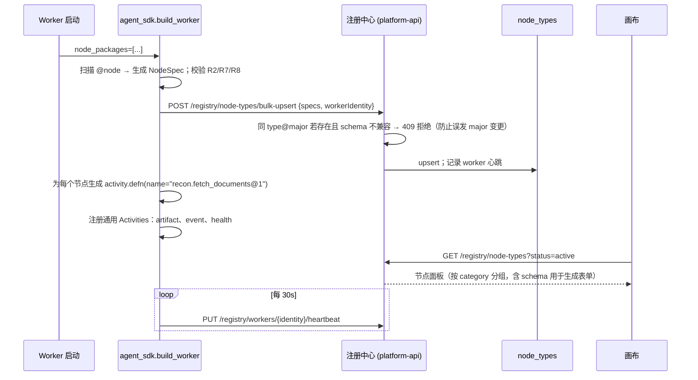

# 原子节点注册 SDK 规范 v1.0

> 目标：后续任何业务原子能力（拉单据、差异识别、LLM 提取、ERP 回写、行情查询……）按本规范封装后，**无需修改平台代码**即可出现在画布节点面板并被 `DagWorkflow` 调度。  
> NodeSpec 机器可读 Schema：[`schemas/node-spec.schema.json`](../schemas/node-spec.schema.json)；示例：[`examples/node-spec.fetch_documents.json`](../examples/node-spec.fetch_documents.json)

---

## 1. 一个节点 = NodeSpec（元数据）+ Activity 实现

```
nodes/recon/
├── __init__.py            # 导出 NODES = [fetch_documents, match_and_diff, ...]
├── fetch_documents.py     # @node 装饰的 Activity 函数 + Pydantic Input/Output 模型
├── match_and_diff.py
├── classify_diff.py
├── generate_report.py
└── tests/
    └── test_fetch_documents.py
```

- **NodeSpec**：`type`、`version`、分类、显示信息、`inputSchema` / `outputSchema` / `configSchema`（JSON Schema）、默认重试 / 超时、是否有副作用、任务队列。由装饰器从 Pydantic 模型自动生成，也可手写 JSON。
- **Activity 实现**：一个 `async def`（或同步函数，SDK 自动放线程池），签名固定为 `(ctx: NodeContext, inputs: InputModel, config: ConfigModel) -> OutputModel`。

## 2. Python SDK 使用方式

```python
# nodes/recon/fetch_documents.py
from pydantic import BaseModel, Field
from agent_sdk import node, NodeContext, RetryableError, NonRetryableError

class Inputs(BaseModel):
    period: str = Field(..., title="对账期间", pattern=r"^\d{4}-\d{2}$")
    supplier_id: str = Field(..., title="供应商编码")
    sources: list[str] = Field(default=["erp_po", "supplier_statement"], title="数据源")

class Config(BaseModel):
    page_size: int = Field(500, ge=50, le=5000, title="分页大小")
    source_profile: str = Field("erp_dev", title="数据源配置名", description="在 Worker 侧解析为连接串，不进 DAG")

class Outputs(BaseModel):
    batches: dict[str, str] = Field(..., title="各数据源 artifact 引用", description="source -> ref://artifact/<id>")
    counts: dict[str, int] = Field(..., title="各数据源单据数")
    total_amount: dict[str, float] = Field(..., title="各数据源金额合计")

@node(
    type="recon.fetch_documents",
    version="1.2.0",                      # semver；major 变化 = 契约不兼容
    name="拉取单据",
    category="对账",
    icon="database",
    description="从 ERP / 供应商对账单库拉取指定期间单据，明细落 artifact，只返回引用与汇总",
    task_queue="nodes-recon",
    side_effect=False,                    # 只读节点；写类节点必须 True 并实现幂等
    default_retry={"maximum_attempts": 5, "initial_interval": "PT2S", "backoff_coefficient": 2.0, "maximum_interval": "PT2M",
                   "non_retryable_error_types": ["ValidationError"]},
    default_timeouts={"start_to_close": "PT10M", "heartbeat": "PT30S"},
    tags=["erp", "read"],
)
async def fetch_documents(ctx: NodeContext, inputs: Inputs, config: Config) -> Outputs:
    ctx.log.info("开始拉取", period=inputs.period, supplier=inputs.supplier_id)
    batches, counts, totals = {}, {}, {}
    for src in inputs.sources:
        rows = []
        async for page in erp_client(config.source_profile).iter_documents(src, inputs.period, inputs.supplier_id, config.page_size):
            rows.extend(page)
            await ctx.heartbeat(f"{src}: {len(rows)} rows")          # 长任务必须心跳
        ref = await ctx.artifacts.put_json(rows, kind=f"documents.{src}")   # 明细不进上下文
        batches[src], counts[src] = ref, len(rows)
        totals[src] = round(sum(r["amount"] for r in rows), 2)
        ctx.log.info("数据源完成", source=src, count=len(rows))
    return Outputs(batches=batches, counts=counts, total_amount=totals)
```

Worker 侧注册：

```python
# apps/worker/main.py
from agent_sdk import build_worker
import nodes.recon, nodes.common

worker = build_worker(
    temporal_target="temporal:7233", namespace="agent-platform",
    node_packages=[nodes.recon, nodes.common],       # 扫描包内 @node，自动 activity.defn + 注册中心上报
    registry_url="http://platform-api:8000",
)
worker.run()
```

## 3. `NodeContext` 能力

| 属性 / 方法 | 说明 |
|---|---|
| `ctx.run_id` / `ctx.node_id` / `ctx.attempt` / `ctx.flow_key` / `ctx.flow_version` | 运行元信息（来自 Activity info + 平台 header） |
| `ctx.idempotency_key` | `sha256(run_id + node_id + attempt_group)`；**写类节点必须**用它做幂等（如 ERP 回写单据上带该 key） |
| `ctx.log.debug/info/warn/error(msg, **fields)` | 结构化日志：本地 stdout + 写入 `run_events`（Redis Stream，类型 `node.log`），前端实时可见。自动附带 run_id / node_id / attempt |
| `await ctx.heartbeat(detail=None)` | Temporal heartbeat + 进度事件 `node.progress`（可传 `percent`） |
| `ctx.artifacts.put_json(obj, kind) -> ref` / `put_bytes(...)` / `get_json(ref)` / `get_bytes(ref)` | 大对象存取；返回 `ref://artifact/<uuid>`；自动记录 `run_id/node_id/size/kind` |
| `ctx.emit_output_preview(obj)` | 可选：提前推送输出预览到监控面板 |
| `ctx.secrets.get(name)` | 从 Worker 环境 / Vault 读取密钥，**DAG 中只放 `credentialRef` 名称** |
| `ctx.llm(profile).complete(...)` / `.extract(schema, text)` | 统一 LLM 客户端：自动记录 token、耗时、成本到指标；`extract` 强制结构化输出（JSON Schema） |
| `ctx.cancelled()` | 检查取消请求，长循环中定期调用 |

## 4. 契约与硬性规则

| # | 规则 | 由谁保证 |
|---|---|---|
| R1 | **所有 IO 只在节点内**。节点不得依赖 Workflow 状态以外的"上一次调用"内存；Worker 可随时重启 | 规范 + Code Review |
| R2 | **输入 / 输出必须有 Schema**（Pydantic 模型或 JSON Schema）；输出必须是 JSON 可序列化 | SDK 启动时校验；缺失则拒绝注册 |
| R3 | **输出大小限制**：序列化后 > 64 KB 时，SDK 自动把超限字段落 artifact 并替换为 `ref`（可配置 `auto_offload_fields`）；> 512 KB 直接报 `OutputTooLarge`（不可重试） | SDK |
| R4 | **幂等**：`side_effect=True` 的节点必须使用 `ctx.idempotency_key`；SDK 提供 `@idempotent(store="pg")` 辅助装饰器（先查后写） | SDK + Checklist |
| R5 | **错误分类**：抛 `RetryableError`（网络抖动、限流、锁冲突）→ 按重试策略重试；抛 `NonRetryableError` / `ValidationError` / `BudgetExceeded` → 立即失败进入 `onError`；未知异常默认视为可重试 | SDK 将其映射为 `ApplicationError(non_retryable=...)` |
| R6 | **长任务必须心跳**：`default_timeouts.heartbeat` 非空时，超过间隔未心跳视为 Worker 失联并重派发 | Temporal |
| R7 | **LLM 节点输出结构化**：输出 Schema 中不允许出现 `next_node` / `route` 之类流程控制字段；LLM 只产出业务字段（`category`、`confidence`、`extracted`），流向由 `branch` 节点决定 | 注册中心校验保留字 |
| R8 | **版本语义**：`major` 变化（输入 / 输出字段删除或类型变更）必须新建 `type@N+1`，旧版本保留并标记 `deprecated`；`minor`/`patch` 只允许新增可选字段、修 bug。DAG 绑定 `type@major`，运行时用该 major 下最新已注册版本 | 注册中心 |
| R9 | **不读当前时间用于业务判断以外的用途**：Activity 内可以自由用 `datetime.now()`（Activity 不受确定性约束），但**时间相关的流程决策**（如"是否超期"）应把时间作为输出字段交给 `branch` | 规范 |
| R10 | **日志脱敏**：`ctx.log` 自动对 `password/token/secret/id_card/bank_no` 等字段掩码；禁止把整份单据打进日志 | SDK |
| R11 | **单测必备**：每个节点至少一个 `NodeTestHarness` 用例（正常、可重试错误、不可重试错误、超限输出自动落 artifact） | CI |

## 5. NodeSpec 结构（注册中心存储 / 画布消费）

```jsonc
{
  "type": "recon.fetch_documents",
  "version": "1.2.0",
  "major": 1,
  "name": "拉取单据",
  "category": "对账",
  "icon": "database",
  "description": "...",
  "taskQueue": "nodes-recon",
  "sideEffect": false,
  "inputSchema":  { "type": "object", "required": ["period", "supplier_id"], "properties": { ... } },
  "outputSchema": { "type": "object", "properties": { ... } },
  "configSchema": { "type": "object", "properties": { ... } },
  "uiSchema": { "sources": { "ui:widget": "checkboxes" } },       // 可选，rjsf uiSchema
  "defaultRetry":    { "maximumAttempts": 5, "initialInterval": "PT2S", "backoffCoefficient": 2.0, "maximumInterval": "PT2M", "nonRetryableErrorTypes": ["ValidationError"] },
  "defaultTimeouts": { "startToClose": "PT10M", "heartbeat": "PT30S" },
  "outputPreview": ["counts", "total_amount"],                      // 监控面板默认展示字段
  "tags": ["erp", "read"],
  "owner": "recon-team",
  "docsUrl": "https://wiki/...",
  "status": "active",                                               // active | deprecated | disabled
  "workers": [ { "identity": "worker-recon-1@host", "lastSeenAt": "..." } ]   // 由注册中心维护
}
```

## 6. 注册流程



- Activity 名 = `type@major`，Workflow 只依赖这个稳定名字。
- Worker 下线超过 `2 × heartbeat` 后，注册中心把 `workers` 清空；若某 type 无在线 Worker，画布节点显示"离线"并在运行前校验告警（但不阻止：Temporal 会等待 Worker 上线）。

## 7. 通用内置节点（`nodes/common`，阶段 1/2 随平台交付）

| type | 说明 |
|---|---|
| `common.http_request@1` | 通用 HTTP 调用（method / url / headers / body 模板；`credentialRef`），用于验证"按规范新增节点不改平台代码" |
| `common.llm_extract@1` | LLM 结构化抽取：输入 `text_ref` / `schema`，输出结构化对象；强制 JSON Schema 校验；预算控制 |
| `common.notify@1` | 企业微信 / 钉钉 / 邮件通知（`side_effect=True`） |
| `common.sql_query@1` | 只读 SQL（白名单数据源、只允许 SELECT、行数上限、自动落 artifact） |
| `common.delay@1` | 空节点占位（真正的定时等待用 Workflow `sleep`，由 `settings` 或未来 `wait` 节点实现） |

## 8. 测试工具

```python
from agent_sdk.testing import NodeTestHarness

async def test_fetch_documents_offloads_detail(mock_erp):
    h = NodeTestHarness(fetch_documents)
    out = await h.run(inputs={"period": "2026-08", "supplier_id": "SUP-1"}, config={"page_size": 100})
    assert out.counts["erp_po"] == 120
    assert out.batches["erp_po"].startswith("ref://artifact/")
    assert h.artifacts.size(out.batches["erp_po"]) > 0
    assert h.events.of_type("node.log")            # 日志已发出
```

`NodeTestHarness` 提供：内存 artifact 存储、内存事件收集、可注入失败（`fail_times=2, error=RetryableError`）、Schema 校验断言。

## 9. 新节点接入 Checklist

- [ ] 定义 `Inputs / Config / Outputs` Pydantic 模型，字段带 `title`（画布表单标签）
- [ ] `@node(type, version, name, category, task_queue, side_effect, default_retry, default_timeouts)`
- [ ] 所有外部 IO 在函数内部；密钥用 `ctx.secrets` / `credentialRef`
- [ ] 大数据落 `ctx.artifacts`，输出只返回引用 + 汇总
- [ ] 长任务定期 `ctx.heartbeat()`；循环中检查 `ctx.cancelled()`
- [ ] 错误分类：明确抛 `RetryableError` / `NonRetryableError`
- [ ] `side_effect=True` 时使用 `ctx.idempotency_key`
- [ ] LLM 输出为结构化业务字段，不含流程控制字段
- [ ] `NodeTestHarness` 单测覆盖：成功 / 可重试失败 / 不可重试失败 / 大输出
- [ ] 加入 Worker 的 `node_packages`；启动后在 `GET /registry/node-types` 与画布面板可见
- [ ] 在文档 `nodes/<pkg>/README.md` 补一行说明与示例 DAG 片段
