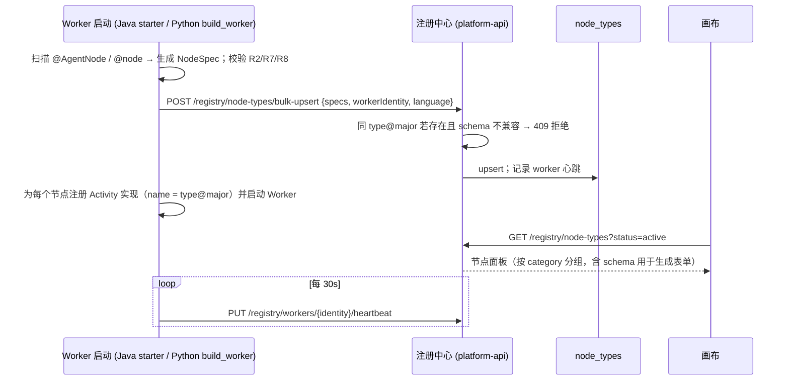

# 原子节点注册 SDK 规范 v1.1（Java 优先 · Python 仅 LLM 节点）

> 目标：后续任何业务原子能力（拉单据、差异识别、LLM 提取、ERP 回写、行情查询……）按本规范封装后，**无需修改平台代码**即可出现在画布节点面板并被 `DagWorkflow` 调度。现有 **AI 采购 / AI 销售 Java 服务**通过内嵌 Worker 即可把原有方法变成节点。  
> NodeSpec 机器可读 Schema：[`schemas/node-spec.schema.json`](../schemas/node-spec.schema.json)；示例：[`examples/node-spec.fetch_documents.json`](../examples/node-spec.fetch_documents.json)

---

## 1. 一个节点 = NodeSpec（元数据）+ Activity 实现

```
nodes/recon/                                   # Maven 模块：nodes-recon
├── src/main/java/com/company/agent/nodes/recon/
│   ├── FetchDocumentsNode.java                # @AgentNode 实现类 + Inputs/Config/Outputs record
│   ├── MatchAndDiffNode.java
│   ├── ClassifyDiffNode.java
│   ├── GenerateReportNode.java
│   └── source/                                # DocumentSource 适配器（直连库 / 接口 / 导出文件）
└── src/test/java/.../FetchDocumentsNodeTest.java
```

- **NodeSpec**：`type`、`version`、分类、显示信息、`inputSchema` / `outputSchema` / `configSchema`（JSON Schema）、默认重试 / 超时、是否有副作用、任务队列。由 `@AgentNode` 注解 + record 类型（Jackson + `victools/jsonschema-generator`）自动生成，也可手写 JSON。
- **Activity 实现**：实现 `NodeActivity<I, C, O>` 接口的 Spring Bean；SDK 负责把它包装成 Temporal Activity（名字 = `type@major`）并注册到 Worker。

## 2. Java SDK 使用方式

```java
// nodes/recon/FetchDocumentsNode.java
@AgentNode(
    type = "recon.fetch_documents",
    version = "1.2.0",                       // semver；major 变化 = 契约不兼容
    name = "拉取单据",
    category = "对账",
    icon = "database",
    description = "从 ERP / 供应商对账单库拉取指定期间单据，明细落 artifact，只返回引用与汇总",
    taskQueue = "nodes-recon",
    sideEffect = false,                      // 只读节点；写类节点必须 true 并实现幂等
    defaultRetry = @Retry(maximumAttempts = 5, initialInterval = "PT2S", backoffCoefficient = 2.0,
                          maximumInterval = "PT2M", nonRetryableErrorTypes = {"ValidationError"}),
    defaultTimeouts = @Timeouts(startToClose = "PT10M", heartbeat = "PT30S"),
    outputPreview = {"counts", "total_amount"},
    tags = {"erp", "read"}, owner = "recon-team")
@Component
public class FetchDocumentsNode implements NodeActivity<FetchDocumentsNode.Inputs, FetchDocumentsNode.Config, FetchDocumentsNode.Outputs> {

  public record Inputs(
      @Title("对账期间") @Pattern(regexp = "^\\d{4}-\\d{2}$") @NotNull String period,
      @Title("供应商编码") @NotNull String supplierId,
      @Title("数据源") @Default("[\"erp_po\",\"supplier_statement\"]") List<String> sources) {}

  public record Config(
      @Title("分页大小") @Min(50) @Max(5000) @Default("500") int pageSize,
      @Title("数据源配置名") @Description("Worker 侧解析为连接串/接口地址/文件目录，密钥不进 DAG") @Default("\"erp_dev\"") String sourceProfile) {}

  public record Outputs(
      @Title("各数据源 artifact 引用") Map<String, String> batches,      // source -> ref://artifact/<id>
      @Title("各数据源单据数") Map<String, Integer> counts,
      @Title("各数据源金额合计(元, 字符串)") Map<String, String> totalAmount) {}

  private final DocumentSourceRegistry sources;                         // 三种接入方式的适配器注册表

  @Override
  public Outputs execute(NodeContext ctx, Inputs in, Config cfg) {
    ctx.log().info("开始拉取", Map.of("period", in.period(), "supplier", in.supplierId()));
    DocumentSource source = sources.byProfile(cfg.sourceProfile());     // jdbc | http | file，由 profile 决定
    Map<String, String> batches = new HashMap<>(); Map<String, Integer> counts = new HashMap<>(); Map<String, String> totals = new HashMap<>();
    for (String src : in.sources()) {
      List<CanonicalDocument> rows = new ArrayList<>();
      for (Page<CanonicalDocument> page : source.iterate(src, in.period(), in.supplierId(), cfg.pageSize())) {
        rows.addAll(page.items());
        ctx.heartbeat(src + ": " + rows.size() + " rows");              // 长任务必须心跳
        ctx.checkCancelled();
      }
      String ref = ctx.artifacts().putJson(rows, "documents." + src);   // 明细不进上下文（MinIO）
      batches.put(src, ref); counts.put(src, rows.size());
      totals.put(src, rows.stream().map(CanonicalDocument::amount).reduce(BigDecimal.ZERO, BigDecimal::add).toPlainString());
      ctx.log().info("数据源完成", Map.of("source", src, "count", rows.size()));
    }
    return new Outputs(batches, counts, totals);
  }
}
```

Worker 侧接入（**任何 Spring Boot 服务**，包括现有 AI 采购 / AI 销售服务）：

```xml
<dependency>
  <groupId>com.company.agent</groupId>
  <artifactId>node-sdk-spring-boot-starter</artifactId>
</dependency>
```

```yaml
# application.yml
agent:
  node-sdk:
    temporal-target: temporal:7233
    namespace: agent-platform
    registry-url: http://platform-api:8080
    worker-identity: ${spring.application.name}@${HOSTNAME}
    task-queues:                       # 一个服务可暴露多个队列
      - name: nodes-purchase
        max-concurrent-activities: 20
    scan-packages: [com.company.purchase.agentnodes]   # 扫描 @AgentNode
```

启动时 starter 自动：扫描 `@AgentNode` → 生成 NodeSpec → 校验（R2/R7/R8）→ `POST /registry/node-types/bulk-upsert` → 为每个节点注册 Activity 实现 → 启动 Worker → 定时心跳。

## 3. `NodeContext` 能力（Java 接口，Python 同名等价）

| 方法 | 说明 |
|---|---|
| `runId()` / `nodeId()` / `attempt()` / `flowKey()` / `flowVersion()` / `itemIndex()` | 运行元信息（Activity Info + 平台 header）；`itemIndex()` 在 `foreach` 体内有值 |
| `idempotencyKey()` | `sha256(runId + nodeId + attemptGroup [+ itemIndex])`；**写类节点必须**用它做幂等 |
| `log().debug/info/warn/error(msg, fields)` | 结构化日志：SLF4J + 写入 `run_events`（Redis Stream，类型 `node.log`），前端实时可见；自动附带 run/node/attempt；自动脱敏 |
| `heartbeat(detail)` / `heartbeat(percent, detail)` | Temporal heartbeat + 进度事件 `node.progress` |
| `checkCancelled()` | 收到取消时抛 `CanceledFailure`，长循环中定期调用 |
| `artifacts().putJson(obj, kind)` / `putBytes(bytes, contentType, kind)` / `putStream(...)` / `getJson(ref, Class)` / `getStream(ref)` | 大对象存取（MinIO）；返回 `ref://artifact/<uuid>`；自动记录 run/node/size/kind |
| `emitOutputPreview(obj)` | 可选：提前推送输出预览到监控面板 |
| `secrets().get(name)` | 从 Worker 环境 / Vault 读取密钥；**DAG 中只放 `credentialRef` 名称** |
| `profiles().documentSource(name)` / `.notification(name)` / `.llm(name)` | 取企业级配置项对应的适配器（决策 2/3/7） |
| `llm(profile).complete(...)` / `.extract(schemaClass, text)` | Java 侧统一 LLM 客户端（OpenAI 兼容协议）；记录 token / 耗时 / 成本指标；`extract` 强制结构化输出 |
| `notify(channel).send(template, params)` | 通过通知中心发送（`side_effect` 节点使用） |

## 4. 契约与硬性规则

| # | 规则 | 由谁保证 |
|---|---|---|
| R1 | **所有 IO 只在节点内**。节点不得依赖上一次调用的内存状态；Worker 可随时重启 | 规范 + Code Review |
| R2 | **输入 / 输出必须有 Schema**（record + 注解或手写 JSON Schema）；输出必须 JSON 可序列化 | starter 启动校验；缺失则拒绝注册 |
| R3 | **输出大小限制**：序列化后 > 64 KB 时，SDK 自动把超限字段落 artifact 并替换为 `ref`（`@AutoOffload` 标注字段优先）；> 512 KB 抛 `OutputTooLarge`（不可重试） | SDK |
| R4 | **幂等**：`sideEffect=true` 的节点必须使用 `idempotencyKey()`；SDK 提供 `IdempotencyStore`（PG 表 `node_idempotency`，先查后写） | SDK + Checklist |
| R5 | **错误分类**：抛 `RetryableNodeException`（网络抖动、限流、锁冲突）→ 按重试策略重试；抛 `NonRetryableNodeException(type)`（`ValidationError` / `BudgetExceeded` / `BusinessRuleViolation`…）→ 立即失败进入 `onError`；未知 RuntimeException 默认可重试 | SDK 映射为 `ApplicationFailure`（`type` 字段 = 错误类型字符串） |
| R6 | **长任务必须心跳**：`heartbeat` 超时非空时，超过间隔未心跳视为 Worker 失联并重派发 | Temporal |
| R7 | **LLM 节点输出结构化**：输出 Schema 中不允许出现 `next_node` / `route` / `goto` 等保留字；LLM 只产出业务字段（`category`、`confidence`、`extracted`） | 注册中心校验 |
| R8 | **版本语义**：`major` 变化（输入 / 输出字段删除或类型变更）必须新建 `type@N+1`；`minor`/`patch` 只允许新增可选字段、修 bug。DAG 绑定 `type@major` | 注册中心兼容性检查（409） |
| R9 | **时间只作为数据**：Activity 内可自由用 `Instant.now()`，但流程决策（如"是否超期"）应把时间作为输出字段交给 `branch` | 规范 |
| R10 | **日志脱敏**：`log()` 自动对 `password/token/secret/idCard/bankNo` 等字段掩码；禁止把整份单据打进日志 | SDK |
| R11 | **单测必备**：每个节点至少一个 `NodeTestHarness` 用例（正常、可重试错误、不可重试错误、超限输出自动落 artifact） | CI |
| R12 | **跨语言 JSON 契约**：见 §5；Java 节点、Python 节点、解释器三方使用同一组 payload 夹具做契约测试 | `packages/contracts` + CI |

## 5. 跨语言契约（Java ↔ Python ↔ 解释器）

| 项 | 约定 |
|---|---|
| Activity 名 | 严格 `type@major`；Java `@ActivityMethod(name)` 由 SDK 生成；Python `@activity.defn(name=...)` |
| Payload 编码 | Temporal 默认 JSON DataConverter（Java Jackson / Python json），`encoding=json/plain` |
| 字段命名 | JSON 一律 **snake_case**；Java 侧 `@JsonNaming(SnakeCaseStrategy.class)` 由 SDK 全局配置 |
| 金额 / 精度 | 不用 double：JSON 为**字符串十进制**（`"12345.67"`）；Java `BigDecimal`，Python `Decimal` |
| 时间 | ISO-8601 字符串，UTC（`2026-09-19T14:25:01.123Z`） |
| 空值 | 可选字段缺省则省略，不传 `null`（除 Schema 显式允许） |
| 错误类型 | `ApplicationFailure.type` 字符串白名单：`ValidationError` / `BudgetExceeded` / `BusinessRuleViolation` / `ExternalServiceError` / `OutputTooLarge`；DAG 的 `nonRetryableErrorTypes` 逐字匹配 |
| Activity 输入信封 | `NodeInvocation { run_meta, node_id, item_index?, inputs, config }`；输出信封 `NodeResult { output, output_ref?, metrics }` |
| 大对象 | 两侧 SDK 都实现 `ArtifactStore`（S3 客户端指向 MinIO） |

## 6. Python SDK（仅 `llm-worker`）

```python
# nodes/llm/classify_text.py
from agent_sdk import node, NodeContext, NonRetryableError
from pydantic import BaseModel, Field

class Inputs(BaseModel):
    text_ref: str = Field(..., title="文本 artifact 引用")
    categories: list[str] = Field(..., title="候选类别")

class Config(BaseModel):
    llm_profile: str = Field("default", title="LLM 配置名")
    max_tokens: int = 2000

class Outputs(BaseModel):
    category: str
    confidence: float
    rationale_ref: str | None = None

@node(type="llm.classify_text", version="1.0.0", name="文本分类(LLM)", category="LLM",
      task_queue="nodes-llm", side_effect=False,
      default_retry={"maximum_attempts": 3, "initial_interval": "PT5S", "non_retryable_error_types": ["ValidationError", "BudgetExceeded"]},
      default_timeouts={"start_to_close": "PT5M", "heartbeat": "PT1M"})
async def classify_text(ctx: NodeContext, inputs: Inputs, config: Config) -> Outputs:
    text = await ctx.artifacts.get_text(inputs.text_ref)
    result = await ctx.llm(config.llm_profile).extract(schema=Outputs, text=text, instructions=f"分类到 {inputs.categories}")
    return result
```

- Python SDK 与 Java SDK 共享同一 NodeSpec 结构、同一注册接口、同一跨语言契约；`llm-worker` **只包含 Activity**，不定义任何 Workflow。
- LLM Profile（决策 7）：`{ name, provider: openai_compatible|azure|private, base_url, model, credential_ref, budget }`，由平台配置，节点只引用名称。

## 7. 现有 Java 智能体服务的接入方式

| 方式 | 做法 | 适用 | 评价 |
|---|---|---|---|
| **A. 内嵌 Worker（推荐）** | 服务引入 `node-sdk-spring-boot-starter`，把原有 Service 方法包成 `@AgentNode`，暴露自己的队列（`nodes-purchase`） | 有源码、可加依赖的 Java 服务 | 获得心跳、取消、重试分类、幂等键、日志回传全部能力；无网络中间层；部署随服务 |
| B. 独立 Adapter Worker | 新建一个 Worker 服务，通过 Feign/RestClient 调用目标服务接口 | 不便改动的服务、第三方系统 | 平台侧仍有完整节点能力，但目标接口需自身幂等；多一层部署 |
| C. `common.http_request` 通用节点 | 画布直接配置 URL / 方法 / body 模板 | 一次性、低频、无需 Schema 的调用 | 零开发；但无类型 Schema、无业务级错误分类，不建议承载核心业务 |

## 8. ERP 单据接入：`DocumentSource` SPI（决策 2）

三种接入方式统一为一个接口与一个**标准单据模型**，节点代码只面对 `CanonicalDocument`：

```java
public interface DocumentSource {
  String kind();                                    // jdbc | http | file
  Iterable<Page<CanonicalDocument>> iterate(String docType, String period, String partyId, int pageSize);
}

public record CanonicalDocument(
    String docType,          // erp_po | erp_invoice | supplier_statement
    String docNo,            // 单号（匹配键）
    String refNo,            // 关联单号（PO/发票）
    String partyId,          // 供应商/客户编码
    LocalDate docDate,
    String currency,
    BigDecimal amount,       // 含税金额
    BigDecimal qty,
    String itemCode,
    Map<String, String> extra) {}
```

| 实现 | 配置（`source_profile`） | 说明 |
|---|---|---|
| `JdbcDocumentSource` | `jdbc_url` / `credential_ref` / **字段映射**（`docNo <- PO_NO`）/ 分页 SQL 模板 / 只读账号 | 直连 ERP 库（SQL Server / Oracle / MySQL）；只允许 SELECT；自动加行数上限 |
| `HttpDocumentSource` | `base_url` / 鉴权 `credential_ref` / 分页参数名 / JSONPath 字段映射 | 走 ERP 或中间层接口 |
| `FileImportDocumentSource` | 文件来源（前端上传到 MinIO / SFTP 目录 / 邮箱附件）/ 格式（xlsx/csv）/ 列映射 / 编码 | 供应商对账单等外部文件；前端提供"上传并映射列"向导，映射保存为 profile |

- **表结构未知不阻塞**：字段映射在 profile 中配置，不同企业不同 ERP 只改配置；节点、DAG、画布都不感知。
- 每个 profile 提供 `test()` 连通性与映射预览接口，管理后台可视化配置。

## 9. NodeSpec 结构（注册中心存储 / 画布消费）

与 v1.0 一致（见 `schemas/node-spec.schema.json`），新增字段：`language`（`java` / `python`）、`supportsForeachItem`（默认 true）。

## 10. 注册流程



## 11. 通用内置节点（`nodes/common`，Java）

| type | 说明 |
|---|---|
| `common.http_request@1` | 通用 HTTP 调用（method / url / headers / body 模板；`credentialRef`） |
| `common.sql_query@1` | 只读 SQL（白名单数据源 profile、只允许 SELECT、行数上限、自动落 artifact） |
| `common.file_import@1` | 从 MinIO / SFTP 读取 xlsx/csv 并按列映射转为标准模型 artifact |
| `common.notify@1` | 通过通知中心按通道名发送（`sideEffect=true`） |
| `llm.extract@1` / `llm.classify_text@1` | LLM 结构化抽取 / 分类（Python `llm-worker`） |

## 12. 测试工具

```java
@Test
void offloadsDetailToArtifact() {
  NodeTestHarness<FetchDocumentsNode> h = NodeTestHarness.of(new FetchDocumentsNode(mockSources));
  var out = h.run(new Inputs("2026-08", "SUP-1", List.of("erp_po")), new Config(100, "erp_dev"));
  assertThat(out.counts()).containsEntry("erp_po", 120);
  assertThat(out.batches().get("erp_po")).startsWith("ref://artifact/");
  assertThat(h.artifacts().size(out.batches().get("erp_po"))).isPositive();
  assertThat(h.events().ofType("node.log")).isNotEmpty();
}
```

`NodeTestHarness` 提供：内存 `ArtifactStore`、内存事件收集、可注入失败（`failTimes(2, RetryableNodeException.class)`）、Schema 校验断言、`foreach` item 上下文模拟。

## 13. 新节点接入 Checklist

- [ ] 定义 `Inputs / Config / Outputs` record，字段带 `@Title`（画布表单标签）
- [ ] `@AgentNode(type, version, name, category, taskQueue, sideEffect, defaultRetry, defaultTimeouts)`
- [ ] 所有外部 IO 在 `execute` 内部；密钥用 `secrets()` / `credentialRef`；数据源用 `profiles().documentSource()`
- [ ] 大数据落 `artifacts()`，输出只返回引用 + 汇总；金额用 `BigDecimal` → 字符串
- [ ] 长任务定期 `heartbeat()`；循环中 `checkCancelled()`
- [ ] 错误分类：明确抛 `RetryableNodeException` / `NonRetryableNodeException(type)`
- [ ] `sideEffect=true` 时使用 `idempotencyKey()`
- [ ] LLM 输出为结构化业务字段，不含流程控制字段
- [ ] `NodeTestHarness` 单测覆盖：成功 / 可重试失败 / 不可重试失败 / 大输出
- [ ] 服务引入 starter，`scan-packages` 包含节点包；启动后在 `GET /registry/node-types` 与画布面板可见
- [ ] 在 `nodes/<pkg>/README.md` 补一行说明与示例 DAG 片段
