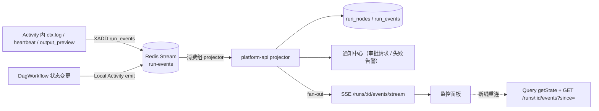

# DAG 解析器与 Temporal Workflow 设计（Java）

> 覆盖：DAG 校验 / 编译 → `ExecutionPlan`；通用解释器 `DagWorkflow`（Temporal Java SDK）；执行、重试、断点、人工审批（Signal）、for-each 循环、日志回传、上下文管理；确定性保障；子流程；升级与回放。

---

## 1. 为什么是"解释器"而不是"代码生成"

| 方案 | 说明 | 结论 |
|---|---|---|
| 代码生成 | 每个 DAG 生成一个 Java Workflow 类，部署 Worker | 每次业务改流程都要重新部署 Worker，与"业务人员改规则不需要后端改代码"冲突 | ✗ |
| **通用解释器** | 一个 `DagWorkflowImpl`，以 `ExecutionPlan` 为输入参数按拓扑解释执行 | 新流程 / 新版本零部署；Plan 作为输入被 Temporal 持久化，天然确定性；解释器升级用 `Workflow.getVersion` 管理 | ✓ |

## 2. 编译阶段（platform-api，非 Workflow 内）

```
DAG JSON ──Schema 校验──► 语义校验 ──绑定──► ExecutionPlan（JSON，随 FlowVersion 与 Run 快照保存）
```

### 2.1 语义校验（`dag-core-java` `DagValidator`）

按 01 文档 §5 清单执行；关键算法：Kahn 拓扑排序检测环；从 `start` BFS 可达性；反向 BFS 检查每个节点可达某 `end`；`branch` / `approval` / `foreach` 出边 handle 完整性；模板静态分析（`context.<key>` 必须由拓扑前驱产生；`item`/`loop` 只允许出现在 `foreach.body`）；`nodeType` 存在且 `active`；规则运算符白名单；`assignees` 引用的角色 / 部门存在。

### 2.2 绑定与 Plan 结构

```jsonc
{
  "planVersion": 1,
  "flowKey": "recon.purchase_monthly",
  "flowVersion": 3,
  "settings": { ... },                                   // 已填默认值
  "nodes": {
    "fetch_docs": {
      "kind": "task",
      "activity": "recon.fetch_documents@1",              // Activity 名（type@major）
      "taskQueue": "nodes-recon",
      "inputs": { ... }, "config": { ... },
      "outputKey": "docs",
      "retry": { "maximumAttempts": 5, "initialInterval": "PT2S", "backoffCoefficient": 2.0, "maximumInterval": "PT2M", "nonRetryableErrorTypes": ["ValidationError"] },
      "timeouts": { "startToClose": "PT10M", "heartbeat": "PT30S" },
      "onError": { "action": "pause" },
      "breakpoint": false
    },
    "is_big_diff": { "kind": "branch", "cases": [...], "default": "none", "evaluation": "first_match" },
    "approve_diff": { "kind": "approval", "assignees": {...}, "strategy": "any", "timeout": "P3D", ... },
    "per_supplier": { "kind": "foreach", "items": "{{context.suppliers.ids}}", "concurrency": 5, "batchSize": 200,
                      "body": { "type": "subflow", "flowKey": "recon.purchase_monthly", "flowVersion": 3, "childPlan": { ... } } },
    "notify": { "kind": "subflow", "flowKey": "common.notify_supplier", "flowVersion": 7, "childPlan": { ... } }
  },
  "edges": [ { "id": "e1", "from": "start", "handle": "out", "to": "fetch_docs" }, ... ],
  "startNode": "start",
  "endNodes": ["end_ok", "end_rejected"]
}
```

- 子流程 / `foreach` 子流程体的 `flowVersion: "published"` 在编译时固化为整数版本，且**子 Plan 内嵌**到父 Plan（`childPlan`），Workflow 运行期没有任何读取。
- 重试 / 超时三层合并：节点配置 > NodeSpec 默认 > `settings` 默认。

## 3. `DagWorkflow` 解释器（`apps/engine-worker`）

### 3.1 接口

```java
@WorkflowInterface
public interface DagWorkflow {
  @WorkflowMethod DagRunOutput run(DagRunInput input);

  @SignalMethod void approve(ApprovalSignal s);            // {nodeId, decision, operator, comment, form}
  @SignalMethod void manualAction(ManualActionSignal s);   // {nodeId, action: retry|skip|abort|resume, operator, reason}
  @SignalMethod void setBreakpoints(BreakpointsSignal s);  // {add[], remove[]}
  @SignalMethod void patchContext(PatchContextSignal s);   // {path, value, operator}
  @SignalMethod void cancel(CancelSignal s);

  @QueryMethod RunState getState();                        // 各节点状态、等待中的信号、断点
  @QueryMethod ContextSnapshot getContext(List<String> paths);

  @UpdateMethod ApprovalResult approveAndValidate(ApprovalSignal s);   // 需要同步校验"节点是否仍在等待"时使用
}

public record DagRunInput(ExecutionPlan plan, Map<String, Object> input, RunMeta runMeta, List<String> breakpoints,
                          ResumeState resume /* continue-as-new 时携带 */) {}
public record DagRunOutput(String status, String endNode, Map<String, Object> outputs, Map<String, Integer> contextSummary) {}
```

### 3.2 内部状态（全部可确定性重建）

```java
public class DagWorkflowImpl implements DagWorkflow {
  private ExecutionPlan plan;
  private RunContext ctx;                                  // {input, context, run}
  private final Map<String, NodeState> nodeState = new HashMap<>();
  private final Map<String, List<ApprovalSignal>> approvals = new HashMap<>();
  private final Map<String, String> manualActions = new HashMap<>();
  private final Set<String> breakpoints = new HashSet<>();
  private boolean cancelRequested;
  private final EventEmitter events = Workflow.newLocalActivityStub(EventEmitter.class, LOCAL_OPTS);   // 事件走 Local Activity
}
```

### 3.3 调度主循环

```java
@Override
public DagRunOutput run(DagRunInput in) {
  init(in);
  events.emit(runStarted());
  Deque<String> frontier = new ArrayDeque<>(successors(plan.startNode(), "out"));
  Map<String, Promise<NodeResult>> active = new HashMap<>();
  nodeState.put(plan.startNode(), NodeState.SUCCEEDED);

  while (!frontier.isEmpty() || !active.isEmpty()) {
    while (!frontier.isEmpty()) {
      String id = frontier.poll();
      if (allRequiredPredsDone(id) && !active.containsKey(id))
        active.put(id, Async.function(this::runNode, id));                 // 并行分叉：Async + Promise
    }
    Promise.anyOf(active.values()).get();                                    // 确定性等待任意一个完成
    for (var it = active.entrySet().iterator(); it.hasNext(); ) {
      var e = it.next();
      if (!e.getValue().isCompleted()) continue;
      NodeResult r = e.getValue().get(); it.remove();
      if (plan.node(r.nodeId()).kind() == Kind.END) return finish(r.nodeId());
      for (String h : r.handles()) frontier.addAll(successors(r.nodeId(), h));
    }
    if (cancelRequested) throw ApplicationFailure.newNonRetryableFailure("已取消", "Cancelled");
  }
  throw ApplicationFailure.newNonRetryableFailure("DAG 未到达任何 end 节点", "DagIncomplete");
}
```

> Temporal Java SDK 的 `Async` / `Promise` / `Workflow.await` 由 SDK 的确定性调度器驱动，可安全用于并行分叉。

### 3.4 单节点执行

```java
private NodeResult runNode(String id) {
  PlanNode node = plan.node(id);
  maybeBreak(id);
  return switch (node.kind()) {
    case TASK     -> new NodeResult(id, runTask(node));
    case BRANCH   -> new NodeResult(id, evalBranch(node));        // 纯函数
    case APPROVAL -> new NodeResult(id, waitApproval(node));      // Signal
    case FOREACH  -> new NodeResult(id, runForeach(node));        // 动态循环
    case SUBFLOW  -> new NodeResult(id, runSubflow(node));        // Child Workflow
    case ASSIGN   -> new NodeResult(id, assign(node));            // 纯函数
    case PARALLEL, JOIN -> new NodeResult(id, Set.of("out"));
    case END      -> new NodeResult(id, Set.of());
    default -> throw new IllegalStateException();
  };
}
```

#### task 节点：执行 + 重试 + onError

```java
private Set<String> runTask(PlanNode node) {
  Map<String, Object> rendered = Templates.render(node.inputs(), ctx.scope());          // 纯函数
  ActivityStub stub = Workflow.newUntypedActivityStub(ActivityOptions.newBuilder()
      .setTaskQueue(node.taskQueue())
      .setRetryOptions(toRetryOptions(node.retry()))                                    // Temporal 自动重试
      .setStartToCloseTimeout(node.timeouts().startToClose())
      .setHeartbeatTimeout(node.timeouts().heartbeat())
      .setScheduleToCloseTimeout(node.timeouts().scheduleToClose())
      .build());
  while (true) {
    setState(node.id(), NodeState.RUNNING); events.emit(nodeStarted(node, rendered));
    try {
      NodeResultPayload out = stub.execute(node.activity(), NodeResultPayload.class,
          new NodeInvocation(runMeta, node.id(), null, rendered, node.config()));
      writeContext(node.outputKey(), out.output());
      setState(node.id(), NodeState.SUCCEEDED); events.emit(nodeSucceeded(node, out));
      return Set.of("out");
    } catch (ActivityFailure e) {                                                        // 重试耗尽 / 不可重试
      setState(node.id(), NodeState.FAILED); events.emit(nodeFailed(node, e));
      switch (node.onError().action()) {
        case FAIL  -> throw e;
        case SKIP  -> { writeContext(node.outputKey(), node.onError().skipOutput()); setState(node.id(), NodeState.SKIPPED); return Set.of("out"); }
        case ROUTE -> { return Set.of("error"); }
        case PAUSE -> {
          String decision = waitManual(node.id());                                       // retry | skip | abort
          if ("retry".equals(decision)) continue;
          if ("skip".equals(decision)) { writeContext(node.outputKey(), null); setState(node.id(), NodeState.SKIPPED); return Set.of("out"); }
          throw ApplicationFailure.newNonRetryableFailure("节点 " + node.id() + " 被人工终止", "Aborted");
        }
      }
    }
  }
}
```

- 自动重试完全交给 Temporal `RetryOptions`；Activity 侧通过 `ApplicationFailure(type, nonRetryable=true)` 短路。
- 手工重试是新的 Activity 调用（新的 attempt group），`idempotencyKey` 随之变化；自动重试期间 key 不变，保证写类节点幂等。

#### branch 节点

```java
private Set<String> evalBranch(PlanNode node) {
  List<String> matched = node.cases().stream().filter(c -> Rules.eval(c.when(), ctx.scope())).map(Case::id).toList();
  String handle = matched.isEmpty() ? node.defaultHandle() : matched.get(0);
  events.emit(branchTaken(node, handle));
  return node.evaluation() == FIRST_MATCH ? Set.of(handle) : (matched.isEmpty() ? Set.of(node.defaultHandle()) : new HashSet<>(matched));
}
```

#### approval 节点：Signal 等待（支持 any / all / quorum）

```java
private Set<String> waitApproval(PlanNode node) {
  String nid = node.id();
  events.emit(approvalRequested(node, Templates.render(node.title(), ctx.scope()), Templates.render(node.summary(), ctx.scope()),
                                node.assignees() /* 表达式，由 platform-api 解析为用户集合并发通知 */));
  setState(nid, NodeState.WAITING_APPROVAL);
  long deadline = node.timeout() == null ? Long.MAX_VALUE : Workflow.currentTimeMillis() + node.timeout().toMillis();
  Duration reminder = node.reminderEvery();

  while (true) {
    Duration waitFor = minOf(remaining(deadline), reminder);
    boolean signalled = Workflow.await(waitFor, () -> decided(nid, node.strategy()) || cancelRequested);
    if (signalled) break;
    if (Workflow.currentTimeMillis() >= deadline) {
      writeContext(node.outputKey(), Map.of("decision", "timeout", "operator", "system", "decided_at", nowIso()));
      events.emit(approvalTimeout(node));
      return switch (node.onTimeout()) { case ROUTE -> Set.of("timeout"); case APPROVE -> Set.of("approved");
                                         case REJECT -> Set.of("rejected"); default -> throw ApplicationFailure.newNonRetryableFailure("审批超时", "ApprovalTimeout"); };
    }
    events.emit(approvalReminder(node));                                               // 通知中心消费事件后再次推送
  }
  Decision d = aggregate(approvals.get(nid), node.strategy());                           // any: 首个；all/quorum: 任一 reject 即 rejected
  writeContext(node.outputKey(), d.toContext(nowIso()));
  setState(nid, NodeState.SUCCEEDED); events.emit(approvalDecided(node, d));
  return Set.of(d.decision());                                                           // approved | rejected
}
```

- Workflow 只持有 `assignees` 表达式；**解析为具体用户属于 IO，在 platform-api 消费 `approval.requested` 事件时完成**，并在 `POST /runs/{id}/approvals/{nodeId}` 校验操作人属于该集合后再发 Signal。
- `nowIso()` 基于 `Workflow.currentTimeMillis()`。

#### foreach 节点：动态循环（阶段 2）

```java
private Set<String> runForeach(PlanNode node) {
  List<Object> items = Templates.renderList(node.items(), ctx.scope());
  if (items.size() > node.maxItems()) throw ApplicationFailure.newNonRetryableFailure("items 超过 maxItems", "ValidationError");
  ForeachState st = resume != null ? resume.foreach(node.id()) : ForeachState.start(items.size());
  WorkflowSemaphore sem = Workflow.newWorkflowSemaphore(node.concurrency());            // SDK 提供的确定性信号量
  List<Promise<Void>> running = new ArrayList<>();

  for (int i = st.next(); i < items.size(); i++) {
    if (i - st.batchStart() >= node.batchSize()) {                                      // History 防线
      Promise.allOf(running).get();
      Workflow.continueAsNew(new DagRunInput(plan, ctx.input(), runMeta, breakpoints, ResumeState.of(ctx, nodeState, node.id(), st.at(i))));
    }
    final int idx = i; final Object item = items.get(i);
    sem.acquire();
    running.add(Async.procedure(() -> {
      try {
        Scope s = ctx.scope().withItem(node.itemAlias(), item, idx, items.size());       // {{item}} / {{loop.index}}
        Map<String, Object> out = node.body().type() == BodyType.TASK
            ? runBodyTask(node, s, idx)                                                   // Activity（NodeInvocation.itemIndex = idx）
            : runBodyChild(node, s, idx);                                                 // Child Workflow：id = runId:nodeId:idx
        st.succeed(idx, Collect.pick(out, node.collect().fields()));
      } catch (Exception e) {
        st.fail(idx, summarize(e));
        if (node.onItemError() == FAIL_FAST) { cancelRequested = true; throw e; }
      } finally { sem.release(); }
    }));
  }
  Promise.allOf(running).get();
  Object collected = Collect.finish(st, node.collect());                                  // 超 64KB 时由 Local Activity 落 artifact → items_ref
  writeContext(node.collect().outputKey(), collected);
  events.emit(foreachFinished(node, st));
  return st.failed() > 0 && node.onItemError() == FAIL_FAST ? Set.of("error") : Set.of("out");
}
```

- 循环体持有的是父上下文的**只读快照**，输出只经 `collect.fields` 白名单回写。
- Child Workflow 方式的每个 item 在 Temporal UI 中是独立执行，监控面板按 `parent_run_id + item_index` 下钻。

### 3.5 断点

```java
private void maybeBreak(String nodeId) {
  if (!breakpoints.contains(nodeId)) return;
  setState(nodeId, NodeState.PAUSED); events.emit(nodePaused(nodeId, "breakpoint"));
  Workflow.await(() -> manualActions.containsKey(nodeId) || cancelRequested);
  String action = manualActions.remove(nodeId);
  if ("abort".equals(action)) throw ApplicationFailure.newNonRetryableFailure("人工终止", "Aborted");
  events.emit(nodeResumed(nodeId));
}
```

### 3.6 上下文写入与限制

```java
private void writeContext(String key, Object value) {
  ctx.put(key, value);
  int size = Json.approxSize(ctx);                                                         // 纯函数
  if (size > settings.context().hardLimitBytes()) throw ApplicationFailure.newNonRetryableFailure("RunContext 超过硬限制", "ContextTooLarge");
  if (size > settings.context().softLimitBytes()) events.emit(contextWarning(size));
}
```

## 4. 日志与事件回传前端



- Activity 侧日志直接写 Redis Stream，不经过 Workflow，避免 History 膨胀。
- Workflow 侧状态事件通过 Local Activity（1s 超时，失败不影响主流程）写 Redis。
- 事件类型：`run.started / run.finished / run.context_warning`、`node.started / node.progress / node.log / node.succeeded / node.failed / node.skipped / node.paused / node.resumed / node.branch`、`foreach.item_started / foreach.item_finished / foreach.finished`、`approval.requested / approval.reminder / approval.decided / approval.timeout`、`context.patched`。
- `node.started` 携带渲染后的输入（≤ 16 KB，超出截断 + `input_ref`）；`node.succeeded` 携带 `outputPreview` 字段 + `output_ref`；完整 IO 通过 `GET /runs/{id}/nodes/{nodeId}/io` 取。

## 5. 确定性保障清单（坑 1 · Java）

| 手段 | 说明 |
|---|---|
| 依赖隔离 | `engine-worker` 的 `workflow` 包只依赖 `io.temporal.workflow`、`dag-core-java`（纯函数）、`contracts`；不注入任何 Spring Bean（Repository / RestClient / Clock） |
| ArchUnit | 测试规则：`noClasses().that().resideInPackage("..workflow..").should().dependOnClassesThat().resideInAnyPackage("java.net..", "java.sql..", "javax.sql..", "org.springframework.web..", "org.springframework.data..")`；禁止调用 `Instant.now / LocalDateTime.now / System.currentTimeMillis / new Random / UUID.randomUUID / Thread.sleep / ThreadLocalRandom` |
| 时间 / 随机 | `Workflow.currentTimeMillis()`、`Workflow.newRandom()`、`Workflow.randomUUID()`、`Workflow.sleep()` |
| 外部数据 | Plan、子 Plan、input 全部是 Workflow 输入；审批人解析等 IO 在 platform-api |
| 事件发送 | Local Activity |
| 并发 | 只用 `Async` / `Promise` / `Workflow.await` / `WorkflowSemaphore`；禁止 `CompletableFuture` / 线程池 |
| 集合遍历 | `HashMap` 迭代顺序在同 JVM 版本内稳定但不保证跨版本；解释器对节点/边遍历一律用 Plan 中的**有序列表** |
| 解释器升级 | `int v = Workflow.getVersion("dag-v2", Workflow.DEFAULT_VERSION, 2); if (v >= 2) {...}`；发布前用生产 History 样本回放 |
| 规则 / 模板引擎 | 纯函数，无浮点随机、无 Locale 依赖；TS / Java 双实现共享 `tests/vectors/*.json` |
| CI | `WorkflowReplayer.replayWorkflowExecution(history, DagWorkflowImpl.class)` 对 `tests/histories/*.json`；`TestWorkflowEnvironment` 时间跳跃做审批超时等测试 |

## 6. 子流程（Child Workflow）

- `subflow` 节点 → `Workflow.newChildWorkflowStub(DagWorkflow.class, ChildWorkflowOptions{ workflowId = runId + ":" + nodeId, parentClosePolicy })`，输入 `DagRunInput(childPlan, renderedInputs, runMeta.child(...))`。
- 子 Plan 编译期内嵌；子流程发布新版本不影响已发布父流程（版本面板提示"有可更新子流程"）。
- `foreach` 子流程体同上，`workflowId = runId:nodeId:itemIndex`。

## 7. 取消与超时

- `settings.runTimeout` → `WorkflowOptions.workflowExecutionTimeout`。
- 取消：`cancel` Signal 置位 → 主循环抛出；运行中的 Activity 通过心跳收到取消，`ctx.checkCancelled()` 感知后清理。
- Activity 超时：`startToClose`（单次）、`scheduleToClose`（含重试总时长）、`heartbeat`（失联检测）。

## 8. Worker 部署拓扑

| Worker | 语言 | Task Queue | 内容 | 扩缩容 |
|---|---|---|---|---|
| `engine-worker` | Java | `dag-engine` | `DagWorkflowImpl` + `EventEmitter` Local Activity | 按运行实例数水平扩展（无状态） |
| `recon-worker` | Java | `nodes-recon` | `nodes/recon`、`nodes/common` | 按 Activity 吞吐扩展 |
| AI 采购 / AI 销售服务 | Java | `nodes-purchase` / `nodes-sales` | 内嵌 starter，暴露原有能力 | 随服务扩展 |
| `llm-worker` | Python | `nodes-llm` | LLM 节点，独立限流 | 独立扩展 |

## 9. 关键测试用例（阶段 1 Demo 验收）

| 用例 | 步骤 | 预期 |
|---|---|---|
| 执行 | 运行 Demo DAG（小额差异输入） | 走 `small` 分支，自动通过，生成报告，`end_ok` |
| 重试 | 在 `match_and_diff` 注入前 2 次 `RetryableNodeException` | Temporal UI attempt=3 成功；监控面板显示 3 次尝试与间隔 |
| 重试耗尽 → 暂停 → 手工重试 | 注入持续失败，`maximumAttempts=3` | 节点 `failed` → `paused`，面板出现"重试 / 跳过 / 终止"；重试后成功 |
| 断点 | 对 `classify_diff` 打断点 | 到达前 `paused`，可查看上下文，`resume` 后继续 |
| 日志回传 | 观察 `fetch_documents` 心跳与日志 | 前端 1s 内可见日志行、进度 |
| 审批 | 大额差异输入 | `waiting_approval`；企业微信收到卡片；面板审批通过后走 `approved` |
| 审批超时 | `TestWorkflowEnvironment` 时间跳跃 `P3D` | 走 `timeout` 出边 |
| for-each | 20 个供应商、`concurrency=5`、其中 2 个失败、`continue` | 18 成功 2 失败，`supplier_results.failed=2`，父流程继续 |
| for-each 分批 | 500 个 item、`batchSize=200` | 发生 2 次 continue-as-new，结果完整 |
| 回放 | 导出以上 History 回放 | 全部通过 |
