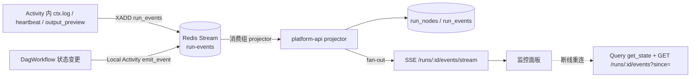

# DAG 解析器与 Temporal Workflow 设计

> 覆盖：DAG 校验 / 编译 → `ExecutionPlan`；通用解释器 `DagWorkflow`；执行、重试、断点、人工审批（Signal）、日志回传、上下文管理；确定性保障；子流程；升级与回放。

---

## 1. 为什么是"解释器"而不是"代码生成"

| 方案 | 说明 | 结论 |
|---|---|---|
| 代码生成 | 每个 DAG 生成一个 Python Workflow 类，部署 Worker | 每次业务改流程都要重新部署 Worker，与"业务人员改规则不需要后端改代码"冲突；Workflow 类爆炸 | ✗ |
| **通用解释器** | 一个 `DagWorkflow`，以 `ExecutionPlan` 为输入参数按拓扑解释执行 | 新流程 / 新版本零部署；Plan 作为输入被 Temporal 持久化，天然确定性；解释器升级用 `workflow.patched` 管理 | ✓ |

## 2. 编译阶段（platform-api，非 Workflow 内）

```
DAG JSON ──Schema 校验──► 语义校验 ──绑定──► ExecutionPlan（JSON，随 FlowVersion 与 Run 快照保存）
```

### 2.1 语义校验（`dag_core.validate`）

按 01 文档 §5 清单执行；关键算法：

- 有向图构建 → Kahn 拓扑排序检测环；
- 从 `start` BFS 可达性；反向 BFS 检查每个节点可达某 `end`；
- `branch` / `approval` 出边 handle 完整性；
- 模板静态分析：解析所有 `{{...}}`，`context.<key>` 必须由某个**拓扑前驱**节点的 `outputKey` 或 `assign` 产生（否则 warning / error 可配）；
- `nodeType` 在注册中心存在且 `status=active`，`inputs` 静态部分符合 `inputSchema`，`config` 符合 `configSchema`；
- 规则表达式：运算符白名单、作用域白名单、`expr` 语法树白名单。

### 2.2 绑定与 Plan 结构

```jsonc
{
  "planVersion": 1,
  "flowKey": "recon.purchase_monthly",
  "flowVersion": 3,
  "settings": { ... },                                   // 已填默认值
  "nodes": {
    "fetch_docs": {
      "kind": "task",
      "activity": "recon.fetch_documents@1",              // Activity 名（type@major）
      "taskQueue": "nodes-recon",
      "inputs": { ... },                                  // 原样，运行时渲染
      "config": { ... },
      "outputKey": "docs",
      "retry": { "maximum_attempts": 5, "initial_interval": "PT2S", ... },   // 三层合并：节点 > NodeSpec 默认 > settings 默认
      "timeouts": { "start_to_close": "PT10M", "heartbeat": "PT30S" },
      "onError": { "action": "pause" },
      "breakpoint": false
    },
    "is_big_diff": { "kind": "branch", "cases": [...], "default": "none", "evaluation": "first_match" },
    "approve_diff": { "kind": "approval", ... , "timeout": "P3D" },
    "notify": { "kind": "subflow", "flowKey": "common.notify_supplier", "flowVersion": 7, "childPlanRef": "plan:common.notify_supplier:7" }
  },
  "edges": [ { "id": "e1", "from": "start", "handle": "out", "to": "fetch_docs" }, ... ],
  "order": ["start", "fetch_docs", "match_diff", ...],   // 拓扑序（调试用）
  "startNode": "start",
  "endNodes": ["end_ok", "end_rejected"]
}
```

- 子流程的 `flowVersion: "published"` 在此刻固化为整数版本；子 Plan 由子 Workflow 启动时按 `flowKey + version` 从 API 取回 **不在父 Workflow 内取**，而是由 platform-api 在 `start_child_workflow` 参数中直接内嵌（父 Plan 中存 `childPlan` 或引用，引用需通过 Local Activity 读取——见 §6）。**推荐：编译期内嵌子 Plan**，彻底避免运行期 IO。

## 3. `DagWorkflow` 解释器（`apps/worker/engine/dag_workflow.py`）

### 3.1 输入 / 输出

```python
@dataclass
class DagRunInput:
    plan: dict            # ExecutionPlan
    input: dict           # 已校验的流程输入
    run_meta: dict        # run_id, flow_key, flow_version, triggered_by, parent_run_id
    breakpoints: list[str] = field(default_factory=list)   # 启动时的运行时断点（覆盖 plan 中的 breakpoint）

@dataclass
class DagRunOutput:
    status: str           # success | failed | cancelled
    end_node: str
    outputs: dict         # end.outputs 渲染结果
    context_summary: dict # 上下文键 + 大小（不含值）
```

### 3.2 内部状态（全部可确定性重建）

```python
class DagWorkflow:
    plan: dict
    ctx: dict                 # RunContext = {"input": {...}, "context": {...}, "run": {...}}
    node_state: dict[str, NodeState]   # pending | ready | running | waiting_approval | paused | succeeded | failed | skipped
    pending_signals: deque    # 收到但尚未处理的 signal
    approvals: dict[str, dict]        # node_id -> decision payload
    breakpoints: set[str]
    manual_actions: dict[str, str]    # node_id -> retry | skip | abort | resume
    cancel_requested: bool
```

### 3.3 调度主循环（伪代码）

```python
@workflow.run
async def run(self, inp: DagRunInput) -> DagRunOutput:
    self._init(inp)
    await self._emit("run.started", {...})
    completed_handles: dict[str, set[str]] = {}          # node_id -> 已触发的出边 handle
    active: dict[str, asyncio.Task] = {}

    self.node_state["start"] = SUCCEEDED
    frontier = self._successors("start", handle="out")

    while frontier or active:
        for node_id in frontier:
            if self._all_required_preds_done(node_id):      # join 语义：默认 all；join.strategy=any 特殊处理
                active[node_id] = asyncio.create_task(self._run_node(node_id))
        frontier = []
        done, _ = await workflow.wait(active.values(), return_when=asyncio.FIRST_COMPLETED)
        for t in done:
            node_id, handles = t.result()                   # 节点完成，返回触发的出边 handle 集合
            del active[node_id]
            for h in handles:
                frontier.extend(self._successors(node_id, h))
            if self.plan["nodes"][node_id]["kind"] == "end":
                return await self._finish(node_id)
        if self.cancel_requested:
            raise CancelledError
    raise ApplicationError("DAG 未到达任何 end 节点", non_retryable=True)
```

> 说明：`asyncio` 在 Temporal Python SDK 的 Workflow 中是**确定性调度**的（SDK 自己的事件循环），允许用 `asyncio.create_task` / `workflow.wait` 实现并行分叉。

### 3.4 单节点执行 `_run_node(node_id)`

```python
async def _run_node(self, node_id) -> tuple[str, set[str]]:
    node = self.plan["nodes"][node_id]
    await self._maybe_break(node_id)                       # 断点：等待 resume/skip/abort
    kind = node["kind"]
    if kind == "task":       return node_id, await self._run_task(node)
    if kind == "branch":     return node_id, self._eval_branch(node)          # 纯函数
    if kind == "approval":   return node_id, await self._wait_approval(node)  # Signal
    if kind == "subflow":    return node_id, await self._run_subflow(node)    # Child Workflow
    if kind == "assign":     return node_id, self._assign(node)               # 纯函数
    if kind in ("parallel", "join"): return node_id, {"out"}
    if kind == "end":        return node_id, set()
```

#### task 节点：执行 + 重试 + onError

```python
async def _run_task(self, node) -> set[str]:
    rendered = render(node["inputs"], scope=self.ctx)                 # 纯函数模板渲染
    while True:
        self._set_state(node["id"], RUNNING); await self._emit("node.started", {...})
        try:
            result = await workflow.execute_activity(
                node["activity"],
                args=[NodeInvocation(run_meta=self.run_meta, node_id=node["id"], inputs=rendered, config=node["config"])],
                task_queue=node["taskQueue"],
                retry_policy=RetryPolicy(**node["retry"]),           # Temporal 自动重试（网络抖动、限流…）
                start_to_close_timeout=..., heartbeat_timeout=..., schedule_to_close_timeout=...,
            )
            self._write_context(node["outputKey"], result.output)   # 小数据 / ref
            self._set_state(node["id"], SUCCEEDED); await self._emit("node.succeeded", {"output_ref": result.output_ref})
            return {"out"}
        except ActivityError as e:                                    # 重试耗尽 / 不可重试错误
            self._set_state(node["id"], FAILED); await self._emit("node.failed", {"error": summarize(e)})
            action = node["onError"]["action"]
            if action == "fail":  raise
            if action == "skip":  self._write_context(node["outputKey"], node["onError"].get("skipOutput")); self._set_state(node["id"], SKIPPED); return {"out"}
            if action == "route": return {"error"}
            # action == "pause": 等待人工决定
            decision = await self._wait_manual(node["id"])            # retry | skip | abort
            if decision == "retry":  continue
            if decision == "skip":   self._write_context(node["outputKey"], None); self._set_state(node["id"], SKIPPED); return {"out"}
            raise ApplicationError(f"节点 {node['id']} 被人工终止", non_retryable=True)
```

- **自动重试**完全交给 Temporal `RetryPolicy`（策略来自三层合并）；Activity 侧通过 `NonRetryableError` 短路。
- **手工重试**是新的 `execute_activity` 调用（新的 attempt group），`idempotency_key` 随之变化 —— 对写类节点，SDK 的 `attempt_group` 只在 `skip→retry` 手工场景变化，自动重试期间保持不变，保证幂等。

#### branch 节点：纯函数求值

```python
def _eval_branch(self, node) -> set[str]:
    scope = self.ctx
    matched = [c["id"] for c in node["cases"] if eval_rule(c["when"], scope)]   # dag_core.rules，纯函数
    if node["evaluation"] == "first_match":
        handle = matched[0] if matched else node["default"]
        self._emit_sync("node.branch", {"matched": handle}); return {handle}
    return set(matched) or {node["default"]}
```

#### approval 节点：Signal 等待

```python
async def _wait_approval(self, node) -> set[str]:
    nid = node["id"]
    payload = {"title": render(node["title"], self.ctx), "summary": render(node["summary"], self.ctx),
               "attachments": render(node["attachments"], self.ctx), "formSchema": node.get("formSchema"),
               "assignees": node["assignees"], "requested_at": workflow.now().isoformat()}
    self._set_state(nid, WAITING_APPROVAL); await self._emit("approval.requested", payload)   # platform-api 落 approvals 表 + 推送 IM
    timeout = parse_duration(node.get("timeout"))
    reminder = node.get("reminder")
    deadline = workflow.now() + timeout if timeout else None
    while nid not in self.approvals:
        wait_for = min(x for x in [remaining(deadline), parse_duration(reminder["every"]) if reminder else None] if x)
        try:
            await workflow.wait_condition(lambda: nid in self.approvals or self.cancel_requested, timeout=wait_for)
        except asyncio.TimeoutError:
            if deadline and workflow.now() >= deadline:
                decision = {"decision": "timeout", "operator": "system", "decided_at": workflow.now().isoformat()}
                self._write_context(node["outputKey"], decision); await self._emit("approval.timeout", {})
                return {"timeout"} if node["onTimeout"] == "route" else self._timeout_policy(node)
            await self._emit("approval.reminder", {})     # 提醒由 platform-api 消费事件发 IM
    decision = self.approvals[nid]
    decision["decided_at"] = workflow.now().isoformat()
    self._write_context(node["outputKey"], decision)
    self._set_state(nid, SUCCEEDED); await self._emit("approval.decided", decision)
    return {decision["decision"]}                          # approved | rejected
```

### 3.5 Signal / Query / Update 定义

| 类型 | 名称 | 参数 | 用途 |
|---|---|---|---|
| Signal | `approve` | `{node_id, decision: approved\|rejected, operator, comment, form}` | 人工审批 |
| Signal | `manual_action` | `{node_id, action: retry\|skip\|abort\|resume, operator, reason}` | 失败暂停后的处置；断点恢复 |
| Signal | `set_breakpoints` | `{add: [node_id], remove: [node_id]}` | 运行时动态断点 |
| Signal | `patch_context` | `{path, value, operator}` | 运营修正上下文（受限：仅 `context.*`，记录审计事件） |
| Signal | `cancel` | `{operator, reason}` | 优雅取消（也支持 Temporal 原生 cancel） |
| Query | `get_state` | — | 各节点状态、当前等待、断点、已处理 signal 数（前端断线重连时兜底） |
| Query | `get_context` | `{paths?}` | 上下文快照（自动截断大字段） |
| Update（可选） | `approve_and_wait` | 同 `approve` | 需要同步返回校验结果时用 Temporal Update（如"该节点已不在等待"直接报错） |

Signal handler 只做**入队 / 写 dict**，不做任何等待或 IO；主循环通过 `wait_condition` 感知。

### 3.6 断点 `_maybe_break`

```python
async def _maybe_break(self, node_id):
    if node_id in self.breakpoints:
        self._set_state(node_id, PAUSED); await self._emit("node.paused", {"reason": "breakpoint"})
        await workflow.wait_condition(lambda: self.manual_actions.get(node_id) in ("resume", "skip", "abort") or self.cancel_requested)
        action = self.manual_actions.pop(node_id, "resume")
        if action == "abort": raise ApplicationError("人工终止", non_retryable=True)
        if action == "skip":  ...  # 与 onError.skip 相同处理
```

- 断点可来自 DAG（设计期 `breakpoint: true`，常用于调试草稿）或 `DagRunInput.breakpoints` / `set_breakpoints` Signal（运行时）。
- 暂停期间可通过 `get_context` Query 查看上下文、`patch_context` 修正后 `resume`。

### 3.7 上下文写入与限制

```python
def _write_context(self, key, value):
    self.ctx["context"][key] = value
    size = approx_json_size(self.ctx)                       # 纯函数
    if size > self.settings["context"]["hardLimitBytes"]:
        raise ApplicationError("RunContext 超过硬限制，请检查节点输出是否应落 artifact", non_retryable=True)
    if size > self.settings["context"]["softLimitBytes"]:
        self._emit_sync("run.context_warning", {"bytes": size})
```

- Activity 返回值由 SDK 保证 ≤ 64 KB（超限自动落 artifact），因此上下文增长可控。
- Temporal 单 Payload 限制 2 MB、History 50 MB / 51200 事件；本方案按节点数 × 每节点 ~5 事件估算，一个 100 节点 DAG 约 500 事件，远低于限制。循环场景（阶段 3）用 `continue_as_new` 携带 `ctx + node_state` 续跑。

## 4. 日志与事件回传前端



- **Activity 侧日志**：`ctx.log` 直接写 Redis Stream（Activity 允许 IO），不经过 Workflow，避免 History 膨胀。
- **Workflow 侧状态事件**：`_emit` 通过 **Local Activity**（`emit_event`，1s 超时，失败不影响主流程）写 Redis；Local Activity 在 History 中只记一个 marker，成本极低。`_emit_sync` 用于纯函数节点（branch/assign）后统一由下一个 await 点批量发送。
- **事件结构**：

```json
{ "event_id": "01J…(ULID，由 projector 分配)", "run_id": "…", "node_id": "match_diff", "attempt": 2,
  "type": "node.log", "level": "info", "ts": "2026-09-19T14:25:01.123Z",
  "message": "匹配完成", "fields": { "matched": 1180, "unmatched": 23 },
  "input_ref": null, "output_ref": "ref://artifact/…", "duration_ms": 8321 }
```

事件类型：`run.started / run.finished / run.context_warning`、`node.started / node.progress / node.log / node.succeeded / node.failed / node.skipped / node.paused / node.resumed / node.branch`、`approval.requested / approval.reminder / approval.decided / approval.timeout`、`context.patched`。

- **输入输出查看**：`node.started` 携带渲染后的输入（≤ 16 KB，超出截断 + `input_ref`）；`node.succeeded` 携带输出预览（`NodeSpec.outputPreview` 字段）+ `output_ref`；完整 IO 通过 `GET /runs/{id}/nodes/{nodeId}/io` 从 `run_nodes` / artifacts 取。
- **事实源**：Temporal History 永远可用于重建；`projector` 幂等（以 `run_id + seq` 去重）。

## 5. 确定性保障清单（坑 1）

| 手段 | 说明 |
|---|---|
| Sandbox | Python SDK 默认 Sandbox：`DagWorkflow` 模块只允许 import `temporalio.workflow`、`dag_core`（纯函数）、标准库白名单；`datetime.now()`、`time`、`random`、`os`、`requests`、DB 驱动在 Workflow 内被拦截报错 |
| 时间 | 一律 `workflow.now()`；模板变量 `run.startedAt` 来自 `workflow.info().start_time` |
| 随机 / UUID | `workflow.random()` / `workflow.uuid4()` |
| 外部数据 | Plan、input 全部作为 Workflow 输入；子 Plan 编译期内嵌；**Workflow 内没有任何 `GET`** |
| 事件发送 | Local Activity，非阻塞主逻辑 |
| 解释器升级 | 行为变更处 `if workflow.patched("dag-v2"): ...`；发布前 `temporal workflow replay` 用生产 History 样本回放 |
| 规则 / 模板引擎 | 纯函数，无浮点随机、无区域设置依赖；TS / Python 双实现共享测试向量 |
| CI | `pytest tests/replay/` 对 `tests/histories/*.json` 回放；`WorkflowEnvironment.start_time_skipping()` 做审批超时等时间相关测试 |

## 6. 子流程（Child Workflow）

- `subflow` 节点 → `workflow.execute_child_workflow(DagWorkflow.run, DagRunInput(plan=child_plan, input=rendered_inputs, run_meta={parent_run_id...}), id=f"{run_id}:{node_id}", parent_close_policy=...)`。
- 子 Plan 编译期内嵌到父 Plan（`nodes.<id>.childPlan`），避免运行期读取。父流程发布时子流程版本被固化；子流程发布新版本不影响已发布的父流程（需重新发布父流程才会采用，版本面板提示"有可更新子流程"）。
- 子流程事件带 `parent_run_id`，监控面板可下钻。

## 7. 取消与超时

- `settings.runTimeout` → Workflow `execution_timeout`。
- 取消：`cancel` Signal 置位 → 主循环 `raise CancelledError`；正在运行的 Activity 收到 cancel（需心跳）后由 `ctx.cancelled()` 感知，做清理。
- Activity 超时类型：`start_to_close`（单次尝试）、`schedule_to_close`（含重试总时长）、`heartbeat`（Worker 失联检测）。

## 8. Worker 部署拓扑

| Worker | Task Queue | 内容 | 扩缩容 |
|---|---|---|---|
| `engine-worker` | `dag-engine` | `DagWorkflow` + `emit_event` Local Activity | 按运行实例数水平扩展（无状态） |
| `recon-worker` | `nodes-recon` | `nodes/recon`、`nodes/common` | 按 Activity 吞吐扩展；可按业务域拆队列（`nodes-sales`、`nodes-llm`） |
| `llm-worker`（可选） | `nodes-llm` | LLM 类节点，独立限流 `max_concurrent_activities` | 独立扩展，避免抢占 |

## 9. 关键测试用例（阶段 1 Demo 验收）

| 用例 | 步骤 | 预期 |
|---|---|---|
| 执行 | 运行 Demo DAG（小额差异输入） | 走 `small` 分支，自动通过，生成报告，`end_ok` |
| 重试 | 在 `match_and_diff` 注入前 2 次 `RetryableError` | Temporal UI 可见 attempt=3 成功；监控面板显示 3 次尝试与间隔 |
| 重试耗尽 → 暂停 → 手工重试 | 注入持续失败，`maximumAttempts=3` | 节点 `failed` → `paused`，面板出现"重试 / 跳过 / 终止"；点击重试后成功 |
| 断点 | 对 `classify_diff` 打断点 | 到达前 `paused`，可查看上下文，`resume` 后继续 |
| 日志回传 | 观察 `fetch_documents` 心跳与日志 | 前端 1s 内可见日志行、进度 |
| 审批 | 大额差异输入 | `waiting_approval`；IM 收到通知；面板审批通过后走 `approved` |
| 审批超时 | 时间跳跃测试 `P3D` | 走 `timeout` 出边 |
| 回放 | 导出以上 History 回放 | 全部通过 |
