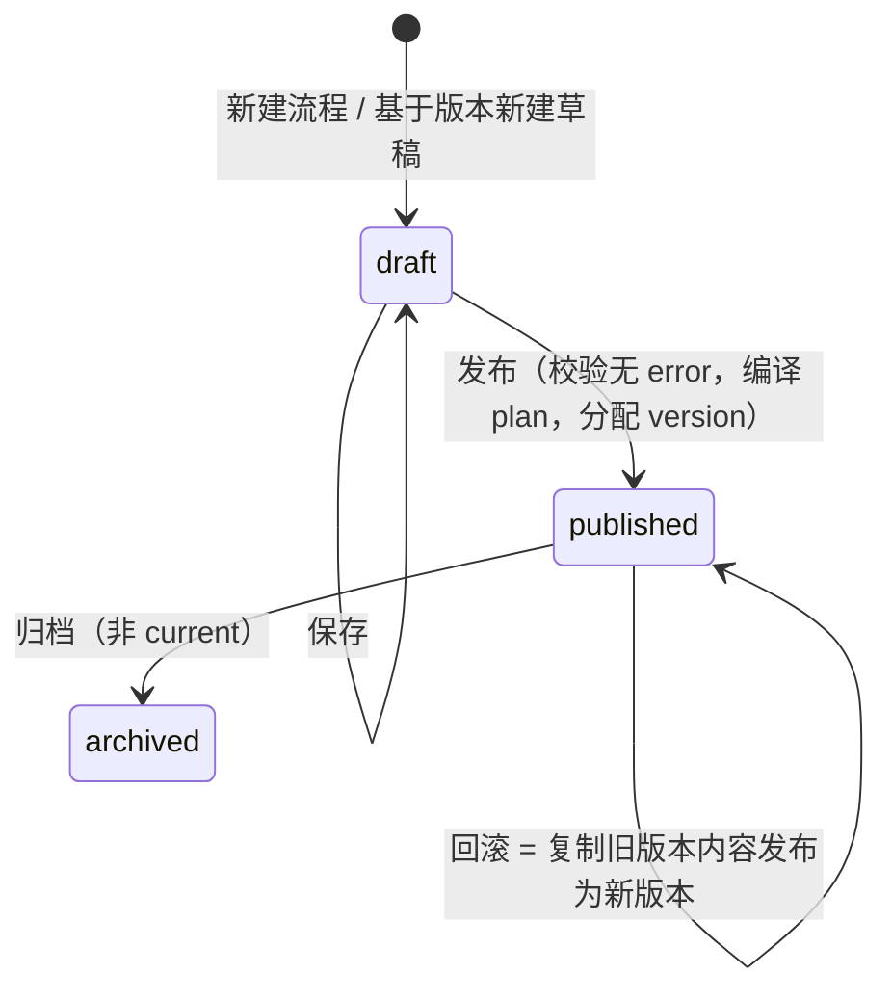

# 中台后端设计（platform-api）：数据模型 · REST/SSE API · 版本管理 · 事件推送 · 开放 API · 度量

> 应用：`apps/platform-api`（Python 3.11 / FastAPI / SQLAlchemy 2 + Alembic / `temporalio` Client / Redis）。所有接口前缀 `/api/v1`，开放 API 前缀 `/open/v1`。

---

## 1. 模块划分

| 模块 | 职责 |
|---|---|
| `flows` | 流程与版本 CRUD、草稿保存、发布、回滚、Diff |
| `compiler` | DAG Schema 校验 + 语义校验 + 编译 `ExecutionPlan`（调用 `dag_core`） |
| `registry` | 节点类型注册 / 查询 / 废弃；Worker 心跳；兼容性检查 |
| `runs` | 启动运行、Signal（审批 / 手工动作 / 断点 / 取消）、Query、运行列表与详情 |
| `events` | Redis Stream 消费 → 投影到 `run_nodes` / `run_events` → SSE fan-out → 告警触发 |
| `approvals` | 待办列表、审批动作、提醒（消费 `approval.*` 事件） |
| `artifacts` | 大对象上传 / 下载 / 预览（开发期 PG，生产 MinIO/S3） |
| `metrics` | 节点耗时 / 失败率 / 审批时长聚合；Prometheus `/metrics` |
| `open` | API Key 鉴权、幂等启动、Webhook 回调 |
| `auth` | 阶段 1 简化：本地用户 + 角色（admin / editor / operator / viewer）；阶段 2 预留 OIDC/SSO 适配 |

## 2. 数据模型（PostgreSQL，库 `platform`）

```sql
-- 流程与版本
CREATE TABLE flows (
  id            UUID PRIMARY KEY,
  key           TEXT UNIQUE NOT NULL,             -- recon.purchase_monthly
  name          TEXT NOT NULL,
  description   TEXT,
  tags          TEXT[] DEFAULT '{}',
  current_version_id UUID,                        -- 当前发布版本（FK 见下）
  draft_version_id   UUID,                        -- 当前草稿（每个流程最多一个草稿）
  owner_id      UUID,
  created_at    TIMESTAMPTZ NOT NULL DEFAULT now(),
  updated_at    TIMESTAMPTZ NOT NULL DEFAULT now()
);

CREATE TABLE flow_versions (
  id            UUID PRIMARY KEY,
  flow_id       UUID NOT NULL REFERENCES flows(id),
  version       INT,                              -- 发布时分配，草稿为 NULL
  status        TEXT NOT NULL CHECK (status IN ('draft','published','archived')),
  dag           JSONB NOT NULL,                   -- DAG JSON（契约）
  plan          JSONB,                            -- 编译后的 ExecutionPlan（发布时生成，不可变）
  based_on_version_id UUID REFERENCES flow_versions(id),
  release_note  TEXT,
  created_by    UUID, created_at TIMESTAMPTZ NOT NULL DEFAULT now(),
  published_by  UUID, published_at TIMESTAMPTZ,
  UNIQUE (flow_id, version)
);
ALTER TABLE flows ADD FOREIGN KEY (current_version_id) REFERENCES flow_versions(id);
ALTER TABLE flows ADD FOREIGN KEY (draft_version_id)   REFERENCES flow_versions(id);

-- 节点注册中心
CREATE TABLE node_types (
  type          TEXT NOT NULL,                    -- recon.fetch_documents
  major         INT  NOT NULL,
  version       TEXT NOT NULL,                    -- 1.2.0（该 major 下最新）
  spec          JSONB NOT NULL,                   -- NodeSpec
  status        TEXT NOT NULL DEFAULT 'active',   -- active | deprecated | disabled
  updated_at    TIMESTAMPTZ NOT NULL DEFAULT now(),
  PRIMARY KEY (type, major)
);
CREATE TABLE node_workers (
  identity      TEXT PRIMARY KEY,                 -- worker-recon-1@host
  task_queue    TEXT NOT NULL,
  node_types    TEXT[] NOT NULL,                  -- ['recon.fetch_documents@1', ...]
  sdk_version   TEXT, last_seen_at TIMESTAMPTZ NOT NULL
);

-- 运行投影
CREATE TABLE runs (
  id            UUID PRIMARY KEY,
  flow_id       UUID NOT NULL REFERENCES flows(id),
  flow_key      TEXT NOT NULL,
  flow_version_id UUID NOT NULL REFERENCES flow_versions(id),
  flow_version  INT NOT NULL,
  workflow_id   TEXT NOT NULL UNIQUE,             -- run:<flow_key>:<run_id>
  temporal_run_id TEXT,
  status        TEXT NOT NULL,                    -- running | waiting_approval | paused | succeeded | failed | cancelled
  input         JSONB NOT NULL,
  outputs       JSONB,
  end_node      TEXT,
  triggered_by  TEXT NOT NULL,                    -- user:<id> | apikey:<id> | schedule:<id> | parent:<run_id>
  parent_run_id UUID,
  idempotency_key TEXT,
  started_at    TIMESTAMPTZ NOT NULL, finished_at TIMESTAMPTZ,
  duration_ms   BIGINT,
  UNIQUE (flow_key, idempotency_key)
);
CREATE INDEX ON runs (flow_id, started_at DESC);
CREATE INDEX ON runs (status) WHERE status IN ('running','waiting_approval','paused');

CREATE TABLE run_nodes (
  run_id        UUID NOT NULL REFERENCES runs(id),
  node_id       TEXT NOT NULL,
  kind          TEXT NOT NULL,
  node_type     TEXT,                             -- task 节点的 type@major
  status        TEXT NOT NULL,
  attempts      INT  NOT NULL DEFAULT 0,
  input_preview JSONB, input_ref TEXT,
  output_preview JSONB, output_ref TEXT,
  error         JSONB,                            -- {type, message, non_retryable, stack_ref}
  branch_taken  TEXT,
  started_at    TIMESTAMPTZ, finished_at TIMESTAMPTZ, duration_ms BIGINT,
  PRIMARY KEY (run_id, node_id)
);

CREATE TABLE run_events (
  id            BIGSERIAL PRIMARY KEY,
  event_id      TEXT UNIQUE NOT NULL,             -- ULID（幂等）
  run_id        UUID NOT NULL,
  node_id       TEXT, attempt INT,
  type          TEXT NOT NULL,                    -- node.log / node.started / approval.requested ...
  level         TEXT,
  ts            TIMESTAMPTZ NOT NULL,
  message       TEXT,
  payload       JSONB
);
CREATE INDEX ON run_events (run_id, id);
-- 按月分区 + 保留策略（开发期 30 天）

CREATE TABLE approvals (
  id            UUID PRIMARY KEY,
  run_id        UUID NOT NULL REFERENCES runs(id),
  node_id       TEXT NOT NULL,
  status        TEXT NOT NULL,                    -- pending | approved | rejected | timeout | cancelled
  title TEXT, summary TEXT, attachments JSONB, form_schema JSONB,
  assignee_roles TEXT[], assignee_users TEXT[],
  requested_at  TIMESTAMPTZ NOT NULL, due_at TIMESTAMPTZ,
  decided_at    TIMESTAMPTZ, operator TEXT, comment TEXT, form JSONB,
  UNIQUE (run_id, node_id)
);

CREATE TABLE artifacts (
  id            UUID PRIMARY KEY,
  run_id        UUID, node_id TEXT,
  kind          TEXT,                             -- documents.erp_po / diff.detail / report.xlsx
  content_type  TEXT NOT NULL,
  size_bytes    BIGINT NOT NULL,
  storage       TEXT NOT NULL,                    -- pg | s3
  inline        BYTEA,                            -- storage=pg
  uri           TEXT,                             -- storage=s3
  created_at    TIMESTAMPTZ NOT NULL DEFAULT now(),
  expires_at    TIMESTAMPTZ
);

CREATE TABLE api_keys (
  id UUID PRIMARY KEY, name TEXT, key_hash TEXT UNIQUE NOT NULL,
  scopes TEXT[] NOT NULL,                         -- ['runs:start:recon.*', 'runs:read']
  webhook_url TEXT, webhook_secret TEXT,
  created_at TIMESTAMPTZ, revoked_at TIMESTAMPTZ
);

CREATE TABLE audit_log (
  id BIGSERIAL PRIMARY KEY, ts TIMESTAMPTZ DEFAULT now(),
  actor TEXT, action TEXT, target TEXT, detail JSONB
);
```

## 3. REST / SSE API

### 3.1 流程与版本

| 方法 | 路径 | 说明 |
|---|---|---|
| GET | `/flows` | 列表（`q`、`tag`、分页） |
| POST | `/flows` | 新建流程（同时创建空草稿） |
| GET | `/flows/{id}` | 详情（含 `current_version`、`draft_version` 摘要） |
| GET | `/flows/{id}/draft` | 获取草稿 DAG |
| PUT | `/flows/{id}/draft` | 保存草稿 DAG（返回 `issues`；有 error 也允许保存，但不可发布） |
| POST | `/flows/{id}/draft/validate` | 只校验不保存 |
| POST | `/flows/{id}/draft/publish` | 发布：校验（必须无 error）→ 编译 plan → 分配 `version` → `status=published` → `current_version_id` 指向 → 创建新空草稿（基于该版本）→ 审计 |
| GET | `/flows/{id}/versions` | 版本列表 |
| GET | `/flows/{id}/versions/{v}` | 版本 DAG / plan |
| GET | `/flows/{id}/versions/diff?from=3&to=4` | 结构化 Diff |
| POST | `/flows/{id}/versions/{v}/rollback` | 回滚：以 `v` 的 DAG 创建新版本并发布（`based_on_version_id=v`，`release_note="rollback to v3"`） |
| POST | `/flows/{id}/versions/{v}/draft` | 基于历史版本新建草稿（覆盖现有草稿需 `?force=true`） |
| POST | `/flows/{id}/versions/{v}/archive` | 归档（不能归档 current） |

### 3.2 节点注册中心

| 方法 | 路径 | 说明 |
|---|---|---|
| GET | `/registry/node-types?status=active&category=` | 画布节点面板数据源 |
| GET | `/registry/node-types/{type}@{major}` | 详情 |
| POST | `/registry/node-types/bulk-upsert` | Worker 启动上报（Worker 内部 token）；兼容性检查：同 major 下 `inputSchema.required` 增加、字段类型变化、`outputSchema` 字段删除 → 409 |
| POST | `/registry/node-types/{type}@{major}/deprecate` | 标记废弃（画布不可新增、已有 DAG 校验 warning） |
| PUT | `/registry/workers/{identity}/heartbeat` | Worker 心跳 |
| GET | `/registry/workers` | 在线 Worker 列表 |

### 3.3 运行

| 方法 | 路径 | 说明 |
|---|---|---|
| POST | `/flows/{key}/runs` | 启动：`{input, version?: int, breakpoints?: [], idempotency_key?}`；默认 `current_version`；校验 `input` 符合 `variables`；`start_workflow(DagWorkflow, DagRunInput(plan, input, run_meta), id="run:<key>:<uuid>", task_queue="dag-engine", search_attributes={FlowKey, FlowVersion})` |
| GET | `/runs?flow_key=&status=&from=&to=` | 运行列表 |
| GET | `/runs/{id}` | 快照：`runs` + `run_nodes` + 上下文摘要（`Query get_context`，仅进行中） |
| GET | `/runs/{id}/events?since=<event_id>&types=&node_id=&limit=` | 历史事件分页 |
| GET | `/runs/{id}/events/stream?since=` | **SSE**：`event: <type>`，`id: <event_id>`，`data: <json>`；心跳 `: ping` 每 15s |
| GET | `/runs/{id}/nodes/{nodeId}/io` | 完整输入 / 输出（解析 artifact 引用） |
| POST | `/runs/{id}/nodes/{nodeId}/actions` | `{action: retry\|skip\|abort\|resume, reason}` → Signal `manual_action`；校验节点当前状态允许该动作 |
| POST | `/runs/{id}/breakpoints` | `{add:[], remove:[]}` → Signal `set_breakpoints` |
| POST | `/runs/{id}/context` | `{path, value}` → Signal `patch_context`（需 operator 角色，审计） |
| POST | `/runs/{id}/cancel` | Signal `cancel`（或 Temporal cancel） |
| GET | `/runs/{id}/temporal` | 跳转 Temporal UI 的链接 |

### 3.4 审批

| 方法 | 路径 | 说明 |
|---|---|---|
| GET | `/approvals?status=pending&mine=true` | 我的待审批（按角色 / 用户匹配） |
| GET | `/approvals/{id}` | 详情（摘要、附件预览、表单 Schema） |
| POST | `/runs/{id}/approvals/{nodeId}` | `{decision: approved\|rejected, comment, form}` → 校验 `form` 符合 `formSchema` → Signal `approve` → `approvals` 表更新 |

### 3.5 Artifacts

| 方法 | 路径 | 说明 |
|---|---|---|
| POST | `/artifacts` | Worker 上传（内部 token） |
| GET | `/artifacts/{id}` / `/artifacts/{id}/preview` | 下载 / 前 N 行 JSON 预览 |

### 3.6 度量

| 方法 | 路径 | 说明 |
|---|---|---|
| GET | `/metrics/flows/{key}?from=&to=&version=` | 运行数、成功率、P50/P95 耗时、各节点耗时 / 失败率 / 重试率、审批平均等待时长、分支命中分布 |
| GET | `/metrics/nodes/{type}@{major}` | 节点类型跨流程统计 |
| GET | `/metrics`（Prometheus 格式） | 应用指标：`platform_runs_started_total{flow_key}`、`platform_node_failed_total{node_type}`、`platform_approval_pending`、`platform_sse_clients`、`platform_run_context_bytes` |

## 4. 版本管理语义



- 每个流程**最多一个草稿**，发布后自动基于新版本生成下一个草稿（可选，避免"发布后无法继续编辑"）。
- `published` 版本**不可变**（DAG、plan 都不改）；任何修改都走草稿。
- 运行绑定 `flow_version_id`；回滚不影响进行中的运行。
- 子流程引用固化：父流程 `plan` 中内嵌子 plan，父流程版本页显示"子流程 `common.notify_supplier` 当前锁定 v7，最新 v9"。
- Diff 算法：按 `node.id` / `edge.id` 对齐，字段级 JSON diff；规则变化以自然语言摘要（"阈值 10000 → 50000"）。

## 5. 事件推送链路

```
Activity ctx.log / Workflow emit_event
   └─► Redis Stream  run-events            (XADD, MAXLEN ~1e6)
          └─► platform-api projector (XREADGROUP, 消费组 "projector", N 副本)
                 ├─► UPSERT run_nodes / INSERT run_events (event_id 幂等)
                 ├─► UPDATE runs.status（由 run.* / node.* 推导）
                 ├─► approvals 表（approval.*）
                 ├─► 告警规则匹配 → Alertmanager webhook / 直接 IM（见 06 文档）
                 └─► Redis Pub/Sub  sse:<run_id>  → 各 API 实例 fan-out 到本地 SSE 连接
```

- SSE 断线重连：客户端带 `since=<event_id>`，服务端先从 `run_events` 补发再切实时。
- 开发期无 Redis 时：`EVENT_BUS=postgres` 使用 `LISTEN/NOTIFY` + `run_events` 表轮询降级（同一接口）。
- 事件保留：Redis Stream 24h；`run_events` 30 天（分区表按月 drop）；Temporal History 按 namespace retention（开发 7 天）。

## 6. 开放 API（外部系统触发）

| 方法 | 路径 | 说明 |
|---|---|---|
| POST | `/open/v1/flows/{key}/runs` | Header `X-API-Key`；Body `{input, idempotency_key, callback_url?, version?}`；scope 校验 `runs:start:<key>`；`idempotency_key` 相同返回已存在 run（`UNIQUE(flow_key, idempotency_key)`） |
| GET | `/open/v1/runs/{id}` | 状态 + `outputs`（完成后） |
| GET | `/open/v1/runs/{id}/events?since=` | 事件（只读） |
| POST | `/open/v1/runs/{id}/approvals/{nodeId}` | 外部系统（如 OA）回传审批结果，scope `approvals:decide` |
| Webhook | → `callback_url` | `run.finished` / `approval.requested` 事件，HMAC-SHA256 签名头 `X-Signature`，重试 5 次指数退避 |

- 限流：按 API Key 令牌桶（默认 60 req/min）；审计写 `audit_log`。
- OpenAPI 文档由 FastAPI 自动生成 `/open/v1/docs`。

## 7. 权限（阶段 1 简化模型）

| 角色 | 能力 |
|---|---|
| viewer | 查看流程 / 运行 / 日志 |
| editor | + 编辑草稿、发布、回滚 |
| operator | + 审批、手工动作、断点、修正上下文、取消 |
| admin | + 注册中心管理、API Key、用户角色 |

阶段 2 预留：审批节点 `assignees.roles` 与角色系统对接；OIDC 登录适配层。

## 8. 关键实现要点

- `start_workflow` 使用 `WorkflowIDReusePolicy.REJECT_DUPLICATE`，`workflow_id` 含 `run_id`，保证幂等。
- `Query get_state` 只在 `runs.status` 为进行中时调用（已完成 run 直接读投影，避免打 Temporal）。
- 大列表接口（runs、events）使用 keyset 分页。
- 所有写操作记 `audit_log`（actor、action、target、detail）。
- Search Attributes：`FlowKey`（Keyword）、`FlowVersion`（Int）、`TriggeredBy`（Keyword），便于在 Temporal UI 直接按流程过滤。
