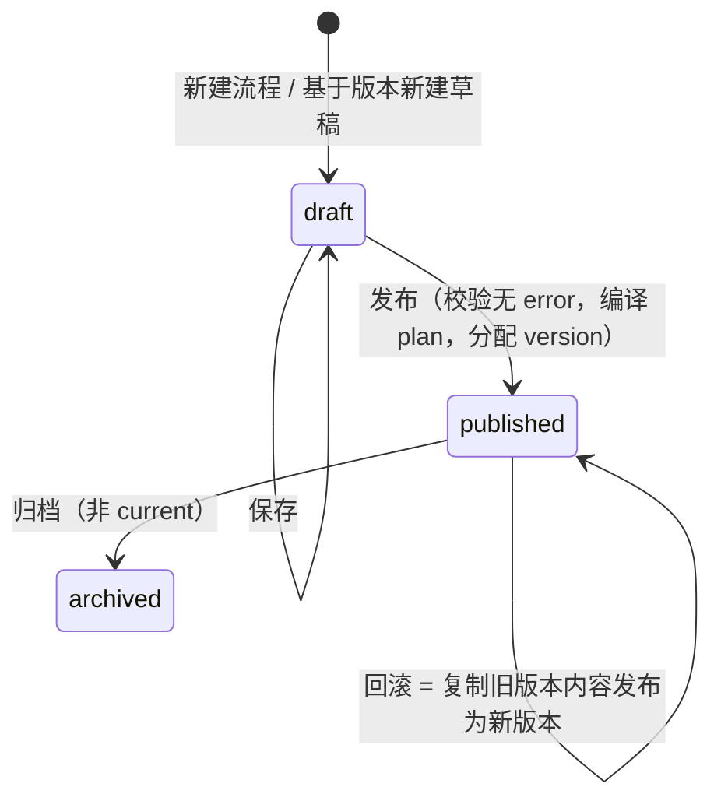

# 中台后端设计（platform-api · Java）：数据模型 · REST/SSE API · 版本管理 · 事件推送 · 身份与组织架构 · 通知中心 · 开放 API · 度量

> 应用：`apps/platform-api`（Java 17 / Spring Boot 3 / Spring Data JPA + Flyway / Temporal Java SDK `WorkflowClient` / Lettuce Redis / MinIO S3 SDK / Spring Security OAuth2 Resource Server / Micrometer）。所有接口前缀 `/api/v1`，开放 API 前缀 `/open/v1`。

---

## 1. 模块划分（Maven 多模块或单体分包）

| 模块 | 职责 |
|---|---|
| `flows` | 流程与版本 CRUD、草稿保存、发布、回滚、Diff |
| `compiler` | DAG Schema 校验 + 语义校验 + 编译 `ExecutionPlan`（调用 `dag-core-java`；子 Plan 内嵌） |
| `registry` | 节点类型注册 / 查询 / 废弃；Worker 心跳；兼容性检查；语言标记 |
| `runs` | 启动运行、Signal（审批 / 手工动作 / 断点 / 取消）、Query、运行列表与详情 |
| `events` | Redis Stream 消费（`projector`）→ 投影到 `run_nodes` / `run_events` / `run_node_items` → SSE fan-out → 告警与通知触发 |
| `approvals` | 待办列表、审批人解析（消费 `approval.requested`）、审批动作校验、提醒 |
| `identity` | OIDC 资源服务器；`IdentityProvider` SPI 同步部门 / 用户 / 角色；权限（RBAC）；审批人表达式解析 |
| `notifications` | `NotificationChannel` SPI（wecom / dingtalk / feishu / email / webhook）；通道配置；模板；告警路由；发送记录 |
| `profiles` | 企业配置项：ERP 数据源 profile（jdbc / http / file）、LLM profile、对象存储；连通性测试、字段映射预览 |
| `artifacts` | 大对象元数据 + MinIO 预签名上传 / 下载 / 预览 |
| `metrics` | 节点耗时 / 失败率 / 审批时长聚合；Micrometer → Prometheus `/actuator/prometheus` |
| `open` | API Key 鉴权、幂等启动、Webhook 回调 |

## 2. 数据模型（PostgreSQL，库 `platform`）

```sql
-- 流程与版本
CREATE TABLE flows (
  id            UUID PRIMARY KEY,
  key           TEXT UNIQUE NOT NULL,             -- recon.purchase_monthly
  name          TEXT NOT NULL,
  description   TEXT,
  tags          TEXT[] DEFAULT '{}',
  current_version_id UUID,                        -- 当前发布版本（FK 见下）
  draft_version_id   UUID,                        -- 当前草稿（每个流程最多一个草稿）
  owner_id      UUID,
  created_at    TIMESTAMPTZ NOT NULL DEFAULT now(),
  updated_at    TIMESTAMPTZ NOT NULL DEFAULT now()
);

CREATE TABLE flow_versions (
  id            UUID PRIMARY KEY,
  flow_id       UUID NOT NULL REFERENCES flows(id),
  version       INT,                              -- 发布时分配，草稿为 NULL
  status        TEXT NOT NULL CHECK (status IN ('draft','published','archived')),
  dag           JSONB NOT NULL,                   -- DAG JSON（契约）
  plan          JSONB,                            -- 编译后的 ExecutionPlan（发布时生成，不可变）
  based_on_version_id UUID REFERENCES flow_versions(id),
  release_note  TEXT,
  created_by    UUID, created_at TIMESTAMPTZ NOT NULL DEFAULT now(),
  published_by  UUID, published_at TIMESTAMPTZ,
  UNIQUE (flow_id, version)
);
ALTER TABLE flows ADD FOREIGN KEY (current_version_id) REFERENCES flow_versions(id);
ALTER TABLE flows ADD FOREIGN KEY (draft_version_id)   REFERENCES flow_versions(id);

-- 节点注册中心
CREATE TABLE node_types (
  type          TEXT NOT NULL,                    -- recon.fetch_documents
  major         INT  NOT NULL,
  version       TEXT NOT NULL,                    -- 1.2.0（该 major 下最新）
  spec          JSONB NOT NULL,                   -- NodeSpec
  language      TEXT NOT NULL DEFAULT 'java',     -- java | python
  status        TEXT NOT NULL DEFAULT 'active',   -- active | deprecated | disabled
  updated_at    TIMESTAMPTZ NOT NULL DEFAULT now(),
  PRIMARY KEY (type, major)
);
CREATE TABLE node_workers (
  identity      TEXT PRIMARY KEY,                 -- worker-recon-1@host
  task_queue    TEXT NOT NULL,
  node_types    TEXT[] NOT NULL,                  -- ['recon.fetch_documents@1', ...]
  sdk_version   TEXT, last_seen_at TIMESTAMPTZ NOT NULL
);

-- 运行投影
CREATE TABLE runs (
  id            UUID PRIMARY KEY,
  flow_id       UUID NOT NULL REFERENCES flows(id),
  flow_key      TEXT NOT NULL,
  flow_version_id UUID NOT NULL REFERENCES flow_versions(id),
  flow_version  INT NOT NULL,
  workflow_id   TEXT NOT NULL UNIQUE,             -- run:<flow_key>:<run_id>
  temporal_run_id TEXT,
  status        TEXT NOT NULL,                    -- running | waiting_approval | paused | succeeded | failed | cancelled
  input         JSONB NOT NULL,
  outputs       JSONB,
  end_node      TEXT,
  triggered_by  TEXT NOT NULL,                    -- user:<id> | apikey:<id> | schedule:<id> | parent:<run_id>
  parent_run_id UUID,
  idempotency_key TEXT,
  started_at    TIMESTAMPTZ NOT NULL, finished_at TIMESTAMPTZ,
  duration_ms   BIGINT,
  UNIQUE (flow_key, idempotency_key)
);
CREATE INDEX ON runs (flow_id, started_at DESC);
CREATE INDEX ON runs (status) WHERE status IN ('running','waiting_approval','paused');

CREATE TABLE run_nodes (
  run_id        UUID NOT NULL REFERENCES runs(id),
  node_id       TEXT NOT NULL,
  kind          TEXT NOT NULL,
  node_type     TEXT,                             -- task 节点的 type@major
  status        TEXT NOT NULL,
  attempts      INT  NOT NULL DEFAULT 0,
  input_preview JSONB, input_ref TEXT,
  output_preview JSONB, output_ref TEXT,
  error         JSONB,                            -- {type, message, non_retryable, stack_ref}
  branch_taken  TEXT,
  started_at    TIMESTAMPTZ, finished_at TIMESTAMPTZ, duration_ms BIGINT,
  PRIMARY KEY (run_id, node_id)
);

CREATE TABLE run_node_items (                     -- foreach 的每个 item
  run_id        UUID NOT NULL,
  node_id       TEXT NOT NULL,
  item_index    INT  NOT NULL,
  item_preview  JSONB,
  status        TEXT NOT NULL,
  child_workflow_id TEXT,                         -- body=subflow 时
  output_preview JSONB, error JSONB,
  started_at TIMESTAMPTZ, finished_at TIMESTAMPTZ, duration_ms BIGINT,
  PRIMARY KEY (run_id, node_id, item_index)
);

CREATE TABLE run_events (
  id            BIGSERIAL PRIMARY KEY,
  event_id      TEXT UNIQUE NOT NULL,             -- ULID（幂等）
  run_id        UUID NOT NULL,
  node_id       TEXT, attempt INT,
  type          TEXT NOT NULL,                    -- node.log / node.started / approval.requested ...
  level         TEXT,
  ts            TIMESTAMPTZ NOT NULL,
  message       TEXT,
  payload       JSONB
);
CREATE INDEX ON run_events (run_id, id);
-- 按月分区 + 保留策略（开发期 30 天）

CREATE TABLE approvals (
  id            UUID PRIMARY KEY,
  run_id        UUID NOT NULL REFERENCES runs(id),
  node_id       TEXT NOT NULL,
  status        TEXT NOT NULL,                    -- pending | approved | rejected | timeout | cancelled
  title TEXT, summary TEXT, attachments JSONB, form_schema JSONB,
  assignees_expr JSONB NOT NULL,                  -- DAG 中的 assignees 表达式
  resolved_user_ids TEXT[] NOT NULL,              -- 解析后的审批人集合（快照）
  strategy      TEXT NOT NULL DEFAULT 'any',
  requested_at  TIMESTAMPTZ NOT NULL, due_at TIMESTAMPTZ,
  decided_at    TIMESTAMPTZ, operator TEXT, comment TEXT, form JSONB,
  UNIQUE (run_id, node_id)
);
CREATE TABLE approval_decisions (                 -- all / quorum 策略下的多人决策明细
  approval_id UUID REFERENCES approvals(id), user_id TEXT, decision TEXT, comment TEXT, form JSONB, decided_at TIMESTAMPTZ,
  PRIMARY KEY (approval_id, user_id)
);

CREATE TABLE artifacts (                          -- 数据在 MinIO，此表只存元数据
  id            UUID PRIMARY KEY,
  run_id        UUID, node_id TEXT, item_index INT,
  kind          TEXT,                             -- documents.erp_po / diff.detail / report.xlsx
  content_type  TEXT NOT NULL,
  size_bytes    BIGINT NOT NULL,
  bucket        TEXT NOT NULL,                    -- agent-artifacts
  object_key    TEXT NOT NULL,                    -- runs/<run_id>/<node_id>/<uuid>
  checksum      TEXT,
  created_at    TIMESTAMPTZ NOT NULL DEFAULT now(),
  expires_at    TIMESTAMPTZ
);

-- 身份与组织架构（由 IdentityProvider 同步，平台只读 + 角色映射可编辑）
CREATE TABLE departments (
  id TEXT PRIMARY KEY, name TEXT NOT NULL, parent_id TEXT, path TEXT NOT NULL,   -- path: /D-ROOT/D-FIN/D-FIN-AP
  leader_user_id TEXT, source TEXT NOT NULL, synced_at TIMESTAMPTZ
);
CREATE TABLE users (
  id TEXT PRIMARY KEY, username TEXT UNIQUE, display_name TEXT, email TEXT, mobile TEXT,
  external_id TEXT, source TEXT NOT NULL,                                       -- oidc subject / 企业微信 userid
  manager_user_id TEXT, status TEXT NOT NULL DEFAULT 'active', synced_at TIMESTAMPTZ
);
CREATE TABLE user_departments (user_id TEXT, department_id TEXT, is_primary BOOLEAN, PRIMARY KEY (user_id, department_id));
CREATE TABLE roles (key TEXT PRIMARY KEY, name TEXT, description TEXT, source TEXT);  -- platform | idp
CREATE TABLE user_roles (user_id TEXT, role_key TEXT, PRIMARY KEY (user_id, role_key));
CREATE TABLE role_mappings (idp_group TEXT PRIMARY KEY, role_key TEXT NOT NULL);       -- IdP 组 → 平台角色

-- 通知中心
CREATE TABLE notification_channels (
  name TEXT PRIMARY KEY,                          -- 如 "wecom-default"
  type TEXT NOT NULL,                             -- wecom | dingtalk | feishu | email | webhook
  config JSONB NOT NULL,                          -- 机器人 webhook / 应用凭据引用 / SMTP 等（密钥用 credential_ref）
  enabled BOOLEAN NOT NULL DEFAULT true,
  is_default BOOLEAN NOT NULL DEFAULT false,
  updated_at TIMESTAMPTZ
);
CREATE TABLE notification_routes (               -- 事件/告警 → 通道
  id UUID PRIMARY KEY, event_type TEXT NOT NULL,  -- approval.requested | node.failed | alert.* | run.finished
  flow_key_pattern TEXT DEFAULT '*', severity_min TEXT, channel_name TEXT REFERENCES notification_channels(name),
  template_key TEXT, enabled BOOLEAN DEFAULT true
);
CREATE TABLE notification_log (
  id BIGSERIAL PRIMARY KEY, ts TIMESTAMPTZ DEFAULT now(), channel_name TEXT, event_type TEXT,
  run_id UUID, recipients TEXT[], status TEXT, error TEXT, payload_ref TEXT
);

-- 企业配置项（ERP 数据源 / LLM / 对象存储 / 身份源）
CREATE TABLE profiles (
  name TEXT PRIMARY KEY,                          -- erp_dev / supplier_files / llm-default
  kind TEXT NOT NULL,                             -- document_source | llm | artifact_store | identity_provider
  type TEXT NOT NULL,                             -- jdbc | http | file | openai_compatible | s3 | oidc | wecom | ldap
  config JSONB NOT NULL,                          -- 连接信息、字段映射；密钥只放 credential_ref
  enabled BOOLEAN NOT NULL DEFAULT true,
  updated_by TEXT, updated_at TIMESTAMPTZ
);
CREATE TABLE credentials (                       -- 密钥引用；值加密存储（或指向 Vault）
  ref TEXT PRIMARY KEY, kind TEXT, encrypted_value BYTEA, vault_path TEXT, updated_at TIMESTAMPTZ
);

CREATE TABLE node_idempotency (                  -- 写类节点幂等（SDK IdempotencyStore）
  key TEXT PRIMARY KEY, run_id UUID, node_id TEXT, result_ref TEXT, created_at TIMESTAMPTZ DEFAULT now()
);

CREATE TABLE api_keys (
  id UUID PRIMARY KEY, name TEXT, key_hash TEXT UNIQUE NOT NULL,
  scopes TEXT[] NOT NULL,                         -- ['runs:start:recon.*', 'runs:read']
  webhook_url TEXT, webhook_secret TEXT,
  created_at TIMESTAMPTZ, revoked_at TIMESTAMPTZ
);

CREATE TABLE audit_log (
  id BIGSERIAL PRIMARY KEY, ts TIMESTAMPTZ DEFAULT now(),
  actor TEXT, action TEXT, target TEXT, detail JSONB
);
```

## 3. REST / SSE API

### 3.1 流程与版本

| 方法 | 路径 | 说明 |
|---|---|---|
| GET | `/flows` | 列表（`q`、`tag`、分页） |
| POST | `/flows` | 新建流程（同时创建空草稿） |
| GET | `/flows/{id}` | 详情（含 `current_version`、`draft_version` 摘要） |
| GET | `/flows/{id}/draft` | 获取草稿 DAG |
| PUT | `/flows/{id}/draft` | 保存草稿 DAG（返回 `issues`；有 error 也允许保存，但不可发布） |
| POST | `/flows/{id}/draft/validate` | 只校验不保存 |
| POST | `/flows/{id}/draft/publish` | 发布：校验（必须无 error）→ 编译 plan → 分配 `version` → `status=published` → `current_version_id` 指向 → 创建新空草稿（基于该版本）→ 审计 |
| GET | `/flows/{id}/versions` | 版本列表 |
| GET | `/flows/{id}/versions/{v}` | 版本 DAG / plan |
| GET | `/flows/{id}/versions/diff?from=3&to=4` | 结构化 Diff |
| POST | `/flows/{id}/versions/{v}/rollback` | 回滚：以 `v` 的 DAG 创建新版本并发布（`based_on_version_id=v`，`release_note="rollback to v3"`） |
| POST | `/flows/{id}/versions/{v}/draft` | 基于历史版本新建草稿（覆盖现有草稿需 `?force=true`） |
| POST | `/flows/{id}/versions/{v}/archive` | 归档（不能归档 current） |

### 3.2 节点注册中心

| 方法 | 路径 | 说明 |
|---|---|---|
| GET | `/registry/node-types?status=active&category=` | 画布节点面板数据源 |
| GET | `/registry/node-types/{type}@{major}` | 详情 |
| POST | `/registry/node-types/bulk-upsert` | Worker 启动上报（Worker 内部 token）；兼容性检查：同 major 下 `inputSchema.required` 增加、字段类型变化、`outputSchema` 字段删除 → 409 |
| POST | `/registry/node-types/{type}@{major}/deprecate` | 标记废弃（画布不可新增、已有 DAG 校验 warning） |
| PUT | `/registry/workers/{identity}/heartbeat` | Worker 心跳 |
| GET | `/registry/workers` | 在线 Worker 列表 |

### 3.3 运行

| 方法 | 路径 | 说明 |
|---|---|---|
| POST | `/flows/{key}/runs` | 启动：`{input, version?: int, breakpoints?: [], idempotency_key?}`；默认 `current_version`；校验 `input` 符合 `variables`；`start_workflow(DagWorkflow, DagRunInput(plan, input, run_meta), id="run:<key>:<uuid>", task_queue="dag-engine", search_attributes={FlowKey, FlowVersion})` |
| GET | `/runs?flow_key=&status=&from=&to=` | 运行列表 |
| GET | `/runs/{id}` | 快照：`runs` + `run_nodes` + 上下文摘要（`Query get_context`，仅进行中） |
| GET | `/runs/{id}/events?since=<event_id>&types=&node_id=&limit=` | 历史事件分页 |
| GET | `/runs/{id}/events/stream?since=` | **SSE**：`event: <type>`，`id: <event_id>`，`data: <json>`；心跳 `: ping` 每 15s |
| GET | `/runs/{id}/nodes/{nodeId}/io` | 完整输入 / 输出（解析 artifact 引用） |
| POST | `/runs/{id}/nodes/{nodeId}/actions` | `{action: retry\|skip\|abort\|resume, reason}` → Signal `manual_action`；校验节点当前状态允许该动作 |
| POST | `/runs/{id}/breakpoints` | `{add:[], remove:[]}` → Signal `set_breakpoints` |
| POST | `/runs/{id}/context` | `{path, value}` → Signal `patch_context`（需 operator 角色，审计） |
| POST | `/runs/{id}/cancel` | Signal `cancel`（或 Temporal cancel） |
| GET | `/runs/{id}/temporal` | 跳转 Temporal UI 的链接 |

### 3.4 审批

| 方法 | 路径 | 说明 |
|---|---|---|
| GET | `/approvals?status=pending&mine=true` | 我的待审批（`resolved_user_ids` 包含当前用户） |
| GET | `/approvals/{id}` | 详情（摘要、附件预览、表单 Schema、审批人列表、已决策明细） |
| POST | `/runs/{id}/approvals/{nodeId}` | `{decision: approved\|rejected, comment, form}` → 校验操作人 ∈ `resolved_user_ids` → 校验 `form` 符合 `formSchema` → Signal `approve` → `approvals` / `approval_decisions` 更新 |
| POST | `/approvals/{id}/transfer` | 转办给其他用户（记录审计，更新 `resolved_user_ids`） |

审批人解析（消费 `approval.requested` 事件时执行，结果快照到 `approvals.resolved_user_ids`）：

| 来源 | 解析 |
|---|---|
| `roles[]` | `user_roles` 中拥有任一角色的用户 |
| `departments[]` | `user_departments`；`includeChildren` 时按 `departments.path` 前缀 |
| `users[]` | 直接 |
| `dynamic[]` | `manager_of_initiator` → `users.manager_user_id`（发起人 = `runs.triggered_by`）；`manager_of:<uid>`；模板表达式渲染为用户 ID / 数组 |
| 结果为空 | 回退到 `notification_routes` 中配置的"兜底审批角色"，并发告警 |

### 3.5 Artifacts（MinIO）

| 方法 | 路径 | 说明 |
|---|---|---|
| POST | `/artifacts/presign-upload` | Worker / 前端获取预签名 PUT URL（内部 token 或用户 token）；成功后 `POST /artifacts/{id}/complete` 写元数据 |
| GET | `/artifacts/{id}` | 302 到预签名 GET URL（有效期 10 分钟） |
| GET | `/artifacts/{id}/preview?rows=100` | JSON / CSV / xlsx 前 N 行预览（服务端流式读取） |

### 3.5.1 身份与组织架构

| 方法 | 路径 | 说明 |
|---|---|---|
| GET | `/identity/me` | 当前用户、角色、部门 |
| GET | `/identity/departments/tree` | 部门树（审批人选择器） |
| GET | `/identity/users?q=&department_id=` | 用户搜索 |
| GET | `/identity/roles` | 角色列表 |
| POST | `/identity/sync` | 触发组织架构同步（admin）；返回同步统计 |
| PUT | `/identity/role-mappings` | IdP 组 → 平台角色映射 |

### 3.5.2 通知中心

| 方法 | 路径 | 说明 |
|---|---|---|
| GET / PUT | `/notifications/channels` | 通道配置（企业微信默认；钉钉 / 飞书 / 邮件 / Webhook） |
| POST | `/notifications/channels/{name}/test` | 发送测试消息 |
| GET / PUT | `/notifications/routes` | 事件 / 告警 → 通道路由 |
| GET | `/notifications/log?run_id=` | 发送记录 |
| POST | `/notifications/alertmanager-webhook` | 接收 Alertmanager 告警，按路由转发到通道（统一消息模板） |

### 3.5.3 企业配置项（Profiles）

| 方法 | 路径 | 说明 |
|---|---|---|
| GET / PUT | `/profiles?kind=document_source` | ERP 数据源 profile（jdbc / http / file 三种类型的配置与字段映射） |
| POST | `/profiles/{name}/test` | 连通性测试 + 抽样 5 行按映射预览为标准单据模型 |
| POST | `/profiles/file-import/infer-mapping` | 上传样例 xlsx/csv，自动推断列映射（可手工调整后保存） |
| GET / PUT | `/profiles?kind=llm` | LLM profile（provider / base_url / model / credential_ref / 预算） |
| GET / PUT | `/credentials` | 密钥引用管理（只写不读，返回掩码） |

### 3.6 度量

| 方法 | 路径 | 说明 |
|---|---|---|
| GET | `/metrics/flows/{key}?from=&to=&version=` | 运行数、成功率、P50/P95 耗时、各节点耗时 / 失败率 / 重试率、审批平均等待时长、分支命中分布 |
| GET | `/metrics/nodes/{type}@{major}` | 节点类型跨流程统计 |
| GET | `/metrics`（Prometheus 格式） | 应用指标：`platform_runs_started_total{flow_key}`、`platform_node_failed_total{node_type}`、`platform_approval_pending`、`platform_sse_clients`、`platform_run_context_bytes` |

## 4. 版本管理语义



- 每个流程**最多一个草稿**，发布后自动基于新版本生成下一个草稿（可选，避免"发布后无法继续编辑"）。
- `published` 版本**不可变**（DAG、plan 都不改）；任何修改都走草稿。
- 运行绑定 `flow_version_id`；回滚不影响进行中的运行。
- 子流程引用固化：父流程 `plan` 中内嵌子 plan，父流程版本页显示"子流程 `common.notify_supplier` 当前锁定 v7，最新 v9"。
- Diff 算法：按 `node.id` / `edge.id` 对齐，字段级 JSON diff；规则变化以自然语言摘要（"阈值 10000 → 50000"）。

## 5. 事件推送链路

```
Activity ctx.log / Workflow emit_event
   └─► Redis Stream  run-events            (XADD, MAXLEN ~1e6)
          └─► platform-api projector (XREADGROUP, 消费组 "projector", N 副本)
                 ├─► UPSERT run_nodes / INSERT run_events (event_id 幂等)
                 ├─► UPDATE runs.status（由 run.* / node.* 推导）
                 ├─► run_node_items（foreach.item_*）
                 ├─► approvals 表（approval.requested → 解析审批人 → 通知中心按路由推送）
                 ├─► 通知路由匹配（node.failed / approval.reminder / run.finished → 通道）
                 └─► Redis Pub/Sub  sse:<run_id>  → 各 API 实例 fan-out 到本地 SSE 连接
```

- SSE 断线重连：客户端带 `since=<event_id>`，服务端先从 `run_events` 补发再切实时（Spring WebFlux `SseEmitter` / `Flux<ServerSentEvent>`）。
- 事件保留：Redis Stream 24h；`run_events` 30 天（分区表按月 drop）；Temporal History 按 namespace retention（开发 7 天）。

## 6. 开放 API（外部系统触发）

| 方法 | 路径 | 说明 |
|---|---|---|
| POST | `/open/v1/flows/{key}/runs` | Header `X-API-Key`；Body `{input, idempotency_key, callback_url?, version?}`；scope 校验 `runs:start:<key>`；`idempotency_key` 相同返回已存在 run（`UNIQUE(flow_key, idempotency_key)`） |
| GET | `/open/v1/runs/{id}` | 状态 + `outputs`（完成后） |
| GET | `/open/v1/runs/{id}/events?since=` | 事件（只读） |
| POST | `/open/v1/runs/{id}/approvals/{nodeId}` | 外部系统（如 OA）回传审批结果，scope `approvals:decide` |
| Webhook | → `callback_url` | `run.finished` / `approval.requested` 事件，HMAC-SHA256 签名头 `X-Signature`，重试 5 次指数退避 |

- 限流：按 API Key 令牌桶（默认 60 req/min）；审计写 `audit_log`。
- OpenAPI 文档由 springdoc 生成 `/open/v1/docs`。

## 7. 身份、组织架构与权限（决策 4）

### 7.1 登录

- 前端 OIDC Authorization Code + PKCE；platform-api 作为 **OAuth2 Resource Server** 校验 JWT。
- 开发环境：Keycloak（docker-compose 内置 realm `agent-platform`，预置用户 / 组）。
- 生产：企业现有 IdP（AD/LDAP、企业微信、钉钉、飞书）通过 Keycloak **Identity Brokering / User Federation** 接入，或直接对接支持 OIDC 的 IdP；平台代码不变。

### 7.2 组织架构同步 `IdentityProvider` SPI

```java
public interface IdentityProvider {
  String type();                                  // oidc-scim | wecom | dingtalk | feishu | ldap
  List<Department> listDepartments();
  List<User> listUsers();                         // 含 manager、部门归属
  List<Group> listGroups();                       // 映射为角色
}
```

- 定时（默认 1h）+ 手动触发全量同步，增量以 `synced_at` 对比；用户停用不删除。
- `role_mappings` 把 IdP 组映射为平台角色；平台自定义角色（如 `recon_ops`）可直接给用户 / 部门授予。

### 7.3 权限模型

| 角色 | 能力 |
|---|---|
| viewer | 查看流程 / 运行 / 日志 |
| editor | + 编辑草稿、发布、回滚 |
| operator | + 审批（须在审批人集合内）、手工动作、断点、修正上下文、取消 |
| admin | + 注册中心管理、API Key、通知通道、Profiles、身份源、角色映射 |

流程级授权（阶段 2 可选）：`flow_permissions(flow_id, principal_type, principal_id, permission)` 限制特定部门 / 角色只能看到自己的流程。

## 8. 通知中心（决策 3）

```java
public interface NotificationChannel {
  String type();                                  // wecom | dingtalk | feishu | email | webhook
  SendResult send(Message msg, List<Recipient> to);   // Recipient 由 user_id 解析为通道侧 ID（企业微信 userid / 邮箱）
}
```

- **企业微信默认**：支持应用消息（按 userid 推送卡片，含"去审批"按钮）与群机器人 Webhook 两种模式。
- 钉钉 / 飞书：应用消息 + 群机器人；邮件：SMTP；Webhook：通用 JSON（对接企业自有 IM）。
- 消息模板（`templates/approval_requested.wecom.md` 等）按通道类型渲染，统一携带运行链接。
- 路由：`notification_routes` 按事件类型 / 流程 key 通配 / 严重级别选择通道；Alertmanager 告警通过 `/notifications/alertmanager-webhook` 走同一路由，保证运维告警与业务通知格式一致。
- 每次发送写 `notification_log`，失败重试 3 次后落告警。

## 9. 关键实现要点

- `WorkflowClient.newWorkflowStub(DagWorkflow.class, WorkflowOptions{ workflowId="run:<key>:<uuid>", taskQueue="dag-engine", workflowIdReusePolicy=REJECT_DUPLICATE, searchAttributes })`，保证幂等。
- `getState` Query 只在 `runs.status` 为进行中时调用（已完成 run 直接读投影）。
- 大列表接口（runs、events、items）使用 keyset 分页。
- 所有写操作记 `audit_log`（actor、action、target、detail）。
- Search Attributes：`FlowKey`（Keyword）、`FlowVersion`（Int）、`TriggeredBy`（Keyword）、`ParentRunId`（Keyword）。
- 密钥：`credentials` 表值用 AES-GCM 加密（主密钥来自环境 / KMS），或 `vault_path` 指向 Vault；API 只写不读。
- 所有 SPI（`DocumentSource` / `NotificationChannel` / `IdentityProvider` / `LlmProvider` / `ArtifactStore`）通过 Spring `@ConditionalOnProperty` + `profiles` 表动态实例化，新增实现只需放入 `integrations/*` 模块。
