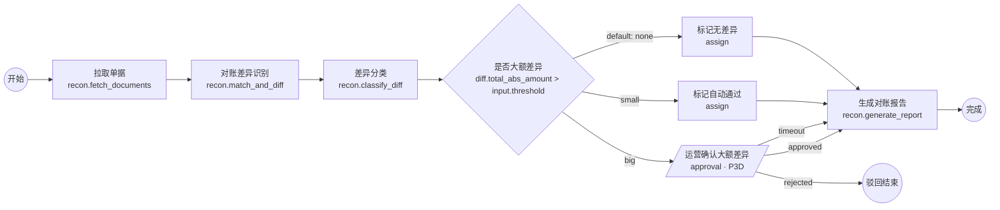
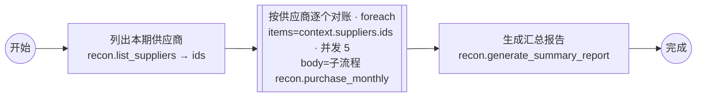

# AI 对账 Demo 设计与阶段计划 / 验收标准

> Demo DAG：[`examples/reconciliation-demo.dag.json`](../examples/reconciliation-demo.dag.json)（单供应商）、[`examples/reconciliation-foreach.dag.json`](../examples/reconciliation-foreach.dag.json)（全部供应商 for-each）

---

## 1. 对账原子能力（Java，阶段 1 封装 4 个核心 + 2 个 for-each 配套）

| 节点 | type | 输入 | 输出（上下文中只有小数据 + 引用） | IO 与外部依赖 |
|---|---|---|---|---|
| 拉取单据 | `recon.fetch_documents@1` | `period`、`supplier_id`、`sources[]`；`config.source_profile` | `batches{source: ref}`、`counts{}`、`total_amount{}`（十进制字符串） | 通过 `DocumentSource` SPI 读取（见 §1.1 三种接入）；明细落 MinIO artifact |
| 对账差异识别 | `recon.match_and_diff@1` | `erp_batch_ref`、`statement_batch_ref`、`amount_tolerance` | `matched_count`、`count`（差异笔数）、`total_abs_amount`、`by_type{missing_in_erp, missing_in_statement, amount_mismatch, qty_mismatch}`、`detail_ref` | 纯计算（可复用现有对账规则代码）；读两个 artifact，写差异明细 artifact |
| 差异分类 | `recon.classify_diff@1` | `diff_detail_ref`、`mode: rules\|llm\|hybrid` | `categories{price_diff, qty_diff, missing, duplicate, other}`、`llm_used`、`confidence_avg`、`classified_ref` | `rules`：Java 纯计算；`llm/hybrid`：调用 `llm.classify_text@1`（Python `llm-worker`）或 Java `ctx.llm(profile)`，只对备注 / 摘要文本做结构化理解 |
| 生成对账报告 | `recon.generate_report@1` | 汇总、分类、审批结果、`diff_detail_ref` | `ref`（xlsx artifact）、`summary_text` | 写 artifact |
| 列出本期供应商 | `recon.list_suppliers@1` | `period`；`config.source_profile` | `ids[]`（只有编码）、`count` | for-each 的 items 来源，刻意只返回 ID 列表 |
| 汇总报告 | `recon.generate_summary_report@1` | `results`（foreach collect 结果） | `ref` | 写 artifact |

流程控制（非节点能力，由 DAG/Workflow 承担）：`branch` 判断"大额差异"、`approval` 人工确认、`foreach` 按供应商循环、`assign` 标记、`end` 输出。

### 1.1 ERP 单据三种接入方式（决策 2）

| 方式 | 适配器 | `source_profile` 配置 | Demo 中的体现 |
|---|---|---|---|
| 直连库 | `JdbcDocumentSource` | 只读 JDBC 连接（`credential_ref`）、分页 SQL 模板、字段映射到标准单据模型 | `erp_dev` profile：连接开发 ERP 库（Demo 用 PG 里的模拟 `erp_po` 表，切 SQL Server 只改 profile） |
| 接口 | `HttpDocumentSource` | base_url、鉴权、分页参数、JSONPath 字段映射 | `erp_api` profile：Demo 提供一个 WireMock/Spring 模拟接口 |
| 导出文件 | `FileImportDocumentSource` | 文件来源（前端上传到 MinIO `agent-uploads` / SFTP）、xlsx/csv 列映射、编码 | `supplier_files` profile：供应商对账单 xlsx 上传，前端"上传并映射列"向导生成映射 |

- 三种方式对节点、DAG、画布完全透明；`fetch_documents.inputs.sources` 中每个 source 名对应一个 profile 内的数据集定义。
- **ERP 表结构未知**不阻塞开发：标准单据模型固定（`doc_no / ref_no / party_id / doc_date / amount / qty / item_code / extra`），映射在 profile 中配置，`POST /profiles/{name}/test` 抽样预览。

## 2. Demo 流程图

### 2.1 for-each Demo（全部供应商）

每个供应商是一个 Child Workflow（内部含自己的审批），`collect.fields` 只回收 `diff_count / decision / report_ref`，父上下文不膨胀。

## 3. Demo 测试矩阵（阶段 1 + 阶段 2）

| # | 用例 | 输入 / 操作 | 预期 | 阶段 |
|---|---|---|---|---|
| T1 | 正常执行 | `supplier_id=SUP-0001`（Mock 小额差异） | `small` 分支 → 自动通过 → 报告 → `end_ok`；监控页全绿 | 1 |
| T2 | 自动重试 | Mock 让 `match_and_diff` 前 2 次抛 `RetryableError` | Temporal UI attempt=3；监控页显示尝试次数、退避间隔；最终成功 | 1 |
| T3 | 重试耗尽暂停 → 手工重试 | Mock 持续失败；点击"重试" | `failed → paused`，IM 告警；手工重试后成功继续 | 1 |
| T4 | 断点 | 对 `classify_diff` 打断点 | 到达前 `paused`；查看上下文 `context.diff`；`resume` 继续 | 1 |
| T5 | 日志回传 | 观察 `fetch_documents` | 每页心跳 / 日志 1s 内到达前端；进度条 | 1 |
| T6 | 大额差异审批通过 | `SUP-0002`（Mock 大额）；运营通过并填表单 | `waiting_approval` → IM 通知 → 通过 → 报告含审批意见 | 2 |
| T7 | 审批驳回 | 驳回 | `end_rejected`，run 状态 `failed`，outputs 含原因 | 2 |
| T8 | 审批超时 | 时间跳跃测试环境 | 走 `timeout` 边生成"待处理"报告 | 2 |
| T9 | 业务人员改规则 | 草稿改阈值为 50000 并发布 | 原大额输入走 `small`；无后端改动 | 2 |
| T10 | 版本回滚 | 回滚到上一版本 | 新运行恢复原行为；进行中运行不受影响 | 2 |
| T11 | 新节点接入 | 按 SDK 规范加 `common.http_request@1` | Worker 启动后画布面板出现；可编排运行 | 1 |
| T12 | 子流程 | 把"通知供应商"作为子流程节点嵌入 | Child Workflow 可见；父流程锁定子版本 | 2（扩展） |
| T13 | 开放 API 触发 | `POST /open/v1/flows/recon.purchase_monthly/runs` + webhook | 幂等；完成后 webhook 收到 `run.finished` | 2（扩展） |
| T14 | 上下文超限保护 | Mock 节点返回 200 KB 输出 | SDK 自动落 MinIO artifact；`context` 中为 ref | 1 |
| T15 | 回放 | 导出 T1–T8 History | `make test-replay` 全部通过 | 1/2 |
| T16 | 三种 ERP 接入 | 同一 DAG 分别切 `erp_dev`（直连库）/ `erp_api`（接口）/ `supplier_files`（上传 xlsx） | 节点代码不变，输出结构一致；文件方式经映射向导 | 1 |
| T17 | for-each 逐项失败继续 | 20 个供应商，2 个注入失败，`continue` | 18 成功 2 失败；`supplier_results.failed=2`；父流程生成汇总报告 | 2 |
| T18 | for-each 分批 | 500 个供应商，`batchSize=200` | 2 次 continue-as-new；Temporal UI 可见续跑链；结果完整 | 2 |
| T19 | 审批人来自组织架构 | 审批节点配置"部门 D-FIN-AP + 发起人上级" | 待办出现在正确用户；非审批人操作被拒（403） | 2 |
| T20 | 通知通道切换 | 把默认通道从企业微信切到邮件 | 同一审批请求走邮件到达；发送记录可查 | 2 |
| T21 | 现有 Java 服务接入 | AI 采购服务引入 starter，暴露 1 个节点 | 画布出现 `purchase.*` 节点；可与对账节点混编运行 | 1 |

## 4. 阶段拆解（按依赖顺序，非时间估算）

### 阶段 1

| 序 | 工作包 | 内容 | 依赖 |
|---|---|---|---|
| 1.1 | 契约 | `schemas/dag.schema.json`、`node-spec.schema.json`、`packages/contracts` TS/Java 类型生成 | — |
| 1.2 | 开发集群 | `deploy/docker-compose.yml`（Temporal + PG + Redis + **MinIO** + **Keycloak** + UI + Prom/Grafana/Alertmanager）、namespace / bucket / realm 初始化、Makefile | — |
| 1.3 | `dag-core-java` + `dag-core-ts` | validate / compile / rules / template，纯函数 + 共享测试向量 | 1.1 |
| 1.4 | `node-sdk-java`（+ starter）/ `node-sdk-python` | `@AgentNode`、`NodeContext`、MinIO `ArtifactStore`、事件、错误、幂等、`NodeTestHarness`；Python 精简版 | 1.1 |
| 1.5 | `integration-spi` + `DocumentSource` 三实现 | jdbc / http / file 适配器、标准单据模型、profile 配置与 `test` 预览 | 1.4 |
| 1.6 | 对账节点 | 6 个节点（Java）+ Demo 数据（PG 模拟表 / WireMock / 样例 xlsx）+ 单测 | 1.4 1.5 |
| 1.7 | `DagWorkflowImpl` | task / branch / assign / end / 断点 / 手工动作 / 事件；ArchUnit + Replay 测试 | 1.3 |
| 1.8 | platform-api 最小版 | flows 草稿 / 校验 / 发布、registry、runs 启动 / 动作、events SSE、artifacts（MinIO 预签名）、profiles、OIDC 资源服务器 | 1.3 1.4 |
| 1.9 | 画布原型 | 面板 / 拖拽 / 连线 / 属性表单 / 保存 / JSON；OIDC 登录；运行监控最小版 | 1.1 1.8 |
| 1.10 | Demo 联调 | T1–T5、T11、T14、T15、T16、T21 | 全部 |

### 阶段 2

| 序 | 工作包 | 内容 | 依赖 |
|---|---|---|---|
| 2.1 | 分支 & 变量透传 | `RuleBuilder`、变量选择器、`assign` 节点 UI、静态引用分析 | 1.9 |
| 2.2 | **for-each** | `foreach` 解释执行（Async/Semaphore/continue-as-new）、`ForEachNode` 容器 UI、item 监控下钻、`run_node_items` 投影 | 1.7 1.9 |
| 2.3 | 重试 / 超时 / 失败处理 UI | 三层默认值展示、Duration 组件、`onError` 四种策略 | 1.9 |
| 2.4 | 版本管理 | 版本页、Diff、回滚、发布后自动草稿 | 1.8 |
| 2.5 | **身份与组织架构** | `IdentityProvider` SPI（Keycloak/SCIM + 企业微信通讯录）、同步任务、角色映射、`AssigneePicker`、审批人解析 | 1.8 |
| 2.6 | 审批节点 | `ApprovalNode`、Signal（any/all/quorum）、`approvals` 表、待办页、转办、超时策略 | 1.7 2.5 |
| 2.7 | **通知中心** | `NotificationChannel` SPI（企业微信应用消息 + 机器人、钉钉、飞书、邮件、Webhook）、路由、模板、Alertmanager 接入、发送记录 | 1.8 |
| 2.8 | 监控告警 | Prometheus 规则、事件驱动告警 → 通知中心、Grafana 看板、节点 IO 查看、时间线 | 1.2 2.7 |
| 2.9 | 子流程 / 开放 API / 度量 | Child Workflow、编译期内嵌子 plan、API Key、Webhook、`/metrics/flows` | 2.4 |
| 2.10 | 业务试用 | 培训手册、T9/T10/T19/T20 演练、收集反馈 | 全部 |

## 5. 验收标准汇总

| 交付物 | 验收 |
|---|---|
| 画布原型 | 能编排 Demo DAG 并保存；导出 JSON 通过 Schema；校验问题可定位节点 |
| Temporal 开发集群 | `make up` 一键启动；Temporal UI / Grafana / MinIO Console / Keycloak 可访问；重启容器后运行实例继续 |
| 可运行 Demo | T1–T5、T16 通过；监控页实时显示状态 / 日志；Temporal UI 可见完整 History |
| 节点 SDK 规范 | 02 文档 + Java/Python SDK + `http_request` 节点 T11、现有 Java 服务接入 T21 通过；Checklist 完整 |
| 阶段 2 | T6–T10、T17–T20 通过；告警按配置通道到达；业务人员独立完成 T9 |

## 6. 风险与应对

| 风险 | 应对 |
|---|---|
| ERP 表结构差异大 | 标准单据模型 + profile 字段映射 + 抽样预览；映射错误在配置期暴露 |
| 导出文件格式不稳定 | 列映射向导 + 模板校验；解析失败作为 `ValidationError` 不重试并提示上传人 |
| LLM 输出不稳定 | `classify_diff` 默认 `rules`；`llm` 模式强制 JSON Schema、置信度阈值、失败回退规则 |
| 业务人员配错规则 | 规则构建器限制运算符；"用历史上下文试算"；发布前校验；一键回滚 |
| Temporal 非确定性（Java 无 Sandbox） | ArchUnit 静态规则 + `WorkflowReplayer` CI + `Workflow.getVersion`；见 03 文档 §5 |
| for-each 规模失控 | `maxItems` / `concurrency` 上限、`batchSize` continue-as-new、只迭代 ID |
| 组织架构同步延迟 | 审批人快照 + 转办；`IdentitySyncStale` 告警 |
| 通知通道故障 | 发送失败重试 + 备用通道 + `NotificationFailing` 告警 |
| 事件量大 | Activity 日志不进 Workflow；Redis Stream + 分区表 + 保留策略 |
| 前后端规则引擎语义漂移 | 共享测试向量文件，CI 双跑（TS / Java） |

## 7. 决策点结论（v0.2 已确认）

| # | 决策点 | 结论 |
|---|---|---|
| 1 | 后端语言 | Java（Spring Boot 3 + Temporal Java SDK）；Python 仅 `llm-worker` |
| 2 | ERP 单据接入 | 直连库 / 接口 / 导出文件三种都支持，`DocumentSource` SPI + profile 映射 |
| 3 | 告警通道 | 企业微信默认，`NotificationChannel` 可配置（钉钉 / 飞书 / 邮件 / Webhook） |
| 4 | 审批人 | 对接组织架构与 SSO（OIDC + `IdentityProvider` 同步） |
| 5 | MinIO | 阶段 1 即引入 |
| 6 | for-each | 提前到阶段 2 |
| 7 | LLM 供应商 | 未指定；按可配置 LLM profile 设计（OpenAI 兼容协议默认），待补充 |

下一步：高保真原型 HTML 已随本版提交（`prototype/`），评审通过后进入阶段 1 开发。
