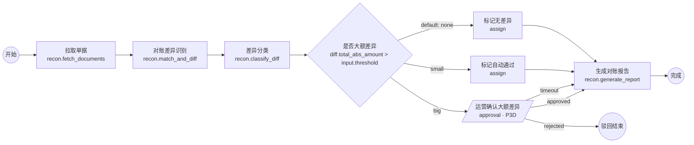

# AI 对账 Demo 设计与阶段计划 / 验收标准

> Demo DAG：[`examples/reconciliation-demo.dag.json`](../examples/reconciliation-demo.dag.json)

---

## 1. 对账原子能力（阶段 1 封装 4 个，其中 3 个为核心）

| 节点 | type | 输入 | 输出（上下文中只有小数据 + 引用） | IO 与外部依赖 |
|---|---|---|---|---|
| 拉取单据 | `recon.fetch_documents@1` | `period`、`supplier_id`、`sources[]` | `batches{source: ref}`、`counts{}`、`total_amount{}` | ERP 采购单库（阶段 1 Mock，可切 SQL Server/接口）、供应商对账单库；明细落 artifact |
| 对账差异识别 | `recon.match_and_diff@1` | `erp_batch_ref`、`statement_batch_ref`、`amount_tolerance` | `matched_count`、`count`（差异笔数）、`total_abs_amount`、`by_type{missing_in_erp, missing_in_statement, amount_mismatch, qty_mismatch}`、`detail_ref` | 纯计算（可复用现有对账规则代码）；读两个 artifact，写差异明细 artifact |
| 差异分类 | `recon.classify_diff@1` | `diff_detail_ref`、`mode: rules\|llm\|hybrid` | `categories{price_diff, qty_diff, missing, duplicate, other}`、`llm_used`、`confidence_avg`、`classified_ref` | `rules`：无外部依赖；`llm/hybrid`：`ctx.llm(profile).extract(schema, text)` 只对备注 / 摘要文本做结构化理解，输出受 Schema 约束 |
| 生成对账报告 | `recon.generate_report@1` | 汇总、分类、审批结果、`diff_detail_ref` | `ref`（xlsx artifact）、`summary_text` | 写 artifact；可选通知 |

流程控制（非节点能力，由 DAG/Workflow 承担）：`branch` 判断"大额差异"、`approval` 人工确认、`assign` 标记、`end` 输出。

## 2. Demo 流程图

## 3. Demo 测试矩阵（阶段 1 + 阶段 2）

| # | 用例 | 输入 / 操作 | 预期 | 阶段 |
|---|---|---|---|---|
| T1 | 正常执行 | `supplier_id=SUP-0001`（Mock 小额差异） | `small` 分支 → 自动通过 → 报告 → `end_ok`；监控页全绿 | 1 |
| T2 | 自动重试 | Mock 让 `match_and_diff` 前 2 次抛 `RetryableError` | Temporal UI attempt=3；监控页显示尝试次数、退避间隔；最终成功 | 1 |
| T3 | 重试耗尽暂停 → 手工重试 | Mock 持续失败；点击"重试" | `failed → paused`，IM 告警；手工重试后成功继续 | 1 |
| T4 | 断点 | 对 `classify_diff` 打断点 | 到达前 `paused`；查看上下文 `context.diff`；`resume` 继续 | 1 |
| T5 | 日志回传 | 观察 `fetch_documents` | 每页心跳 / 日志 1s 内到达前端；进度条 | 1 |
| T6 | 大额差异审批通过 | `SUP-0002`（Mock 大额）；运营通过并填表单 | `waiting_approval` → IM 通知 → 通过 → 报告含审批意见 | 2 |
| T7 | 审批驳回 | 驳回 | `end_rejected`，run 状态 `failed`，outputs 含原因 | 2 |
| T8 | 审批超时 | 时间跳跃测试环境 | 走 `timeout` 边生成"待处理"报告 | 2 |
| T9 | 业务人员改规则 | 草稿改阈值为 50000 并发布 | 原大额输入走 `small`；无后端改动 | 2 |
| T10 | 版本回滚 | 回滚到上一版本 | 新运行恢复原行为；进行中运行不受影响 | 2 |
| T11 | 新节点接入 | 按 SDK 规范加 `common.http_request@1` | Worker 启动后画布面板出现；可编排运行 | 1 |
| T12 | 子流程 | 把"通知供应商"作为子流程节点嵌入 | Child Workflow 可见；父流程锁定子版本 | 2（扩展） |
| T13 | 开放 API 触发 | `POST /open/v1/flows/recon.purchase_monthly/runs` + webhook | 幂等；完成后 webhook 收到 `run.finished` | 2（扩展） |
| T14 | 上下文超限保护 | Mock 节点返回 200 KB 输出 | SDK 自动落 artifact；`context` 中为 ref | 1 |
| T15 | 回放 | 导出 T1–T8 History | `make test-replay` 全部通过 | 1/2 |

## 4. 阶段拆解（按依赖顺序，非时间估算）

### 阶段 1

| 序 | 工作包 | 内容 | 依赖 |
|---|---|---|---|
| 1.1 | 契约 | `schemas/dag.schema.json`、`node-spec.schema.json`、`packages/contracts` 类型生成 | — |
| 1.2 | 开发集群 | `deploy/docker-compose.yml`（Temporal + PG + UI + Redis + Prom/Grafana）、namespace 初始化、Makefile | — |
| 1.3 | `dag-core`（Python） | validate / compile / rules / template，纯函数 + 测试向量 | 1.1 |
| 1.4 | `node-sdk` | `@node`、`NodeContext`、artifact、事件、错误、`NodeTestHarness`、`build_worker` | 1.1 |
| 1.5 | 对账节点 | 4 个节点 + Mock 数据源 + 单测 | 1.4 |
| 1.6 | `DagWorkflow` | task / branch / assign / end / 断点 / 手工动作 / 事件；Replay 测试 | 1.3 |
| 1.7 | platform-api 最小版 | flows 草稿保存 / 校验 / 发布、registry、runs 启动 / 动作、events SSE、artifacts | 1.3 1.4 |
| 1.8 | 画布原型 | 面板 / 拖拽 / 连线 / 属性表单 / 保存 / JSON；运行监控最小版（状态着色 + 日志流 + 动作按钮） | 1.1 1.7 |
| 1.9 | Demo 联调 | T1–T5、T11、T14、T15 | 全部 |

### 阶段 2

| 序 | 工作包 | 内容 | 依赖 |
|---|---|---|---|
| 2.1 | 分支 & 变量透传 | `RuleBuilder`、变量选择器、`assign` 节点 UI、静态引用分析 | 1.8 |
| 2.2 | 重试 / 超时 / 失败处理 UI | 三层默认值展示、Duration 组件、`onError` 四种策略 | 1.8 |
| 2.3 | 版本管理 | 版本页、Diff、回滚、发布后自动草稿 | 1.7 |
| 2.4 | 审批节点 | `ApprovalNode`、Signal、`approvals` 表、待办页、IM 通知与提醒、超时策略 | 1.6 1.7 |
| 2.5 | 监控告警 | Prometheus 规则、事件驱动告警、Grafana 看板、节点 IO 查看、时间线 | 1.2 1.7 |
| 2.6 | 子流程 / 开放 API / 度量 | Child Workflow、编译期内嵌子 plan、API Key、Webhook、`/metrics/flows` | 2.3 |
| 2.7 | 业务试用 | 培训手册、T9/T10 演练、收集反馈 | 全部 |

## 5. 验收标准汇总

| 交付物 | 验收 |
|---|---|
| 画布原型 | 能编排 Demo DAG 并保存；导出 JSON 通过 Schema；校验问题可定位节点 |
| Temporal 开发集群 | `make up` 一键启动；Temporal UI / Grafana 可访问；重启容器后运行实例继续 |
| 可运行 Demo | T1–T5 通过；监控页实时显示状态 / 日志；Temporal UI 可见完整 History |
| 节点 SDK 规范 | 02 文档 + SDK 包 + `http_request` 节点 T11 通过；Checklist 完整 |
| 阶段 2 | T6–T10 通过；告警到 IM；业务人员独立完成 T9 |

## 6. 风险与应对

| 风险 | 应对 |
|---|---|
| ERP 数据接入方式未定 | 阶段 1 用 Mock + 适配器接口 `DocumentSource`，切换只改 Worker 配置 |
| LLM 输出不稳定 | `classify_diff` 默认 `rules`；`llm` 模式强制 JSON Schema、置信度阈值、失败回退规则 |
| 业务人员配错规则 | 规则构建器限制运算符；"用历史上下文试算"；发布前校验；一键回滚 |
| Temporal 非确定性 | Sandbox + Replay CI + `patched`；见 03 文档 §5 |
| 事件量大 | Activity 日志不进 Workflow；Redis Stream + 分区表 + 保留策略 |
| 前后端规则引擎语义漂移 | 共享测试向量文件，CI 双跑 |

## 7. 待确认决策点（与 00 文档 §10 相同，集中列出便于评审）

1. 后端语言：Python（推荐）还是 TypeScript。
2. ERP 单据数据接入方式与表结构。
3. LLM 供应商 / 私有化与合规要求。
4. 告警通道（企业微信 / 钉钉 / 飞书 / 邮件）。
5. 审批人模型是否对接组织架构 / SSO。
6. 是否阶段 2 引入 MinIO。
7. 动态 for-each / 循环是否提前到阶段 2。

确认后进入下一步：生成高保真原型 HTML（画布编辑器、属性面板、运行监控、审批弹窗、版本管理页）。
